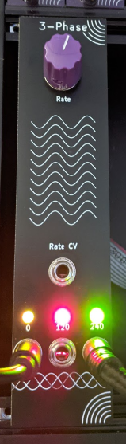

# 3-Phase LFO

##### What is this?

3 Phase LFO is a simple LFO which produces sine-ish waveforms using a somewhat unconventional circuit. It has a two-colour LED to indicate polarity of each output. There is also a single input which can be used to clock the LFO, but it works a little strangely when mixed with the speed control.

##### How much power does it use?

I've no idea for this one I'm afriad! The design only uses the + and - 12v rails, with the +5v rail unused.

##### Where does the design come from?

The original schematic is from Rene Schmitz's Three-phase LFO page ([Three phase LFO](https://www.schmitzbits.de/triphase.html)). Rene's pages are full of wonderful little circuits and are well worth exploring.

##### Are there any rare/weird parts used?

This is an all through-hole design, so if you're a parts hoarder like me you might well have the bits to make it already! There are some odd capacitor values here and there, and you will need a CD4053 and CD4069 to build it too.

##### Are there any problems with the design?

As Rene notes on their website, the LFO can take a bit of time to get going if the power is turned on with the speed control all the way counter-clockwise.

I also found that the mixing of the speed input and the speed control was a little strange. I think the design could probably do with a proper mixer section and maybe some level-shifting.

Originally, the design had the CD4053 connected across +12v and -12v. This produced smoke, a burned ceramic smell, and a dead IC.

##### Do you have a BOM/Mouser cart/Tayda links?

Sorry, no. Things go out of stock so frequently it'd be a lot of work to keep these up to date. Everything in this project is easy to source though, so you should not have any trouble.

##### Can I buy PCBs or a kit?

Not for this design I'm afraid, there are a few too many flaws! If you really want a PCB & panel set, do get in touch though - I have a few spares.

