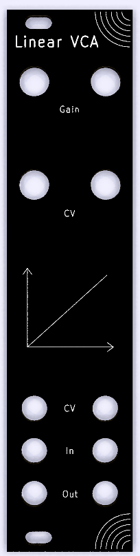
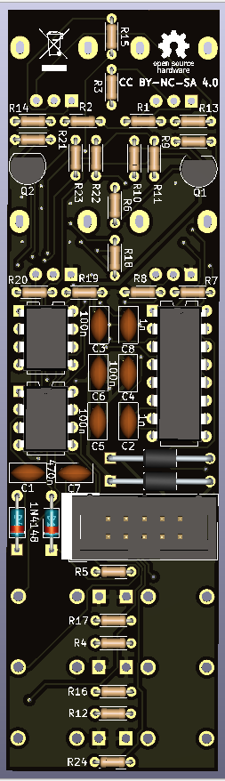

# VCA

##### What is this?

A straightforward 2-channel VCA with CV inputs and an offset per channel. Basically, makes noise quieter (or anything else you want to modulate).

##### How much power does it use?

Next to nothing! Around 10ma on both +/- 12v when both channels are fully "open".

##### Where does the design come from?

This is almost a complete copy of the schematic from [this wonderful ElectricDruid article.](https://electricdruid.net/design-a-eurorack-vintage-vca-with-the-lm13700/)

##### Are there any rare/weird parts used?

The LM13700 is about the most exotic thing in the design, and that can be found pretty much everywhere - I got mine from RS in the UK.

##### Are there any problems with the design?

While the component layout is pretty neat and tidy, the routing is an absolute disaster. In spite of that it all still works and doesn't sound noisy or anything like that.

The resistor footprints on the PCB are also a little small, so I had to stand my resistors up. If you used 1/8th watt resistors they'd probably fit fine.

Finally, I also somehow neglected to add power decoupling for the +/-12v rails at the power connector, but there is reverse polarity protection present.

If I were to give this a second try, I'd add state LEDs to everything (CV, input, output) and probably make the panel just a touch wider to allow for better ergonomics. You might get by with skinny trimmer potentiometers but I'm personally not much of a fan of those.

##### Do you have a BOM/Mouser cart/Tayda links?

Sorry, no. Things go out of stock so frequently it'd be a lot of work to keep these up to date. Everything in this project is easy to source though, so you should not have any trouble.

##### Can I buy PCBs or a kit?

Send me an email (twigathy+synth@gmail.com)...

(Add some rendered images of the panel and back of PCB(s).)

