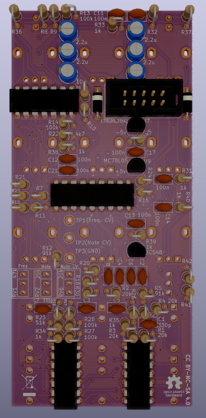

# VCDO

##### What is this?

A 10hp Wavetable oscillator with 1v/octave control, pitch, bitcrush, glide, and a separate sub-oscillator output.

##### How much power does it use?

As measured by the Joranalogue Test 3, around 40 mA on +12v and 10 mA on -12v at peak. The 5v rail is unused.

##### Where does the design come from?

The original schematic is from the datasheet for the VCDO chip on the ElectricDruid website (https://electricdruid.net/product/vcdo-wavetable-oscillator/). There were a couple of tweaks to add test points and buffered LED drivers for the main and sub-oscillator outputs.

##### Are there any rare/weird parts used?

If you're handy at flashing PIC chips you can flash  your own, however I'd strongly suggest supporting ElectricDruid and buying chips from them directly instead! Other than that, there are no exotic parts used. Some of the resistor values are _little_ less common, but resistors are very cheap. I just got 50-packs of values I didn't have for less than £1 each.

##### Are there any problems with the design?

Quite a few, but nothing that has proven to be a killer so far... Here are some things I'd like to improve if ever there were a v2

- Some of the controls are "reversed", such as the bitcrush, frequency and fine controls. I think this comes from me misreading the original schematic a little. I have not fixed the Kicad schematics here yet!
- The space between the Glide control and Glide toggle is a bit limited. It would have probably been better to mount the Glide toggle just a little further down, between the control and the input jacks
- While I specified a dual-colour LED it turns out that's not really very interesting at VCO rates. You could easily swap that out for a single-colour LED provided you get the polarity right
- The LEDs at the top are a little close to the controls, I made sure only a little of the dome of my LEDs was poking out. If you are building one yourself, you can do this, use a flat-topped LED, or even use light pipes and an SMD LED on the LED pads...
- It would've been nice to include LED indicators for CV parameters, but there was not enough board space, and I'm not really sure where on the panel they could usefully go either
- The vertically mounted resistors work fine, but now that I know SMD assembly isn't really that expensive, maybe go for surface mount and have them pre-soldered next time around
- Calibration trimmers worked fine, but the test points a little fiddly to access - keep them further away from other parts in future

##### Do you have a BOM/Mouser cart/Tayda links?

Sorry, no. Things go out of stock so frequently it'd be a lot of work to keep these up to date. Everything in this project is easy to source though, so you should not have any trouble.

##### Can I buy PCBs or a kit?

Send me an email (twigathy+synth@gmail.com)...

