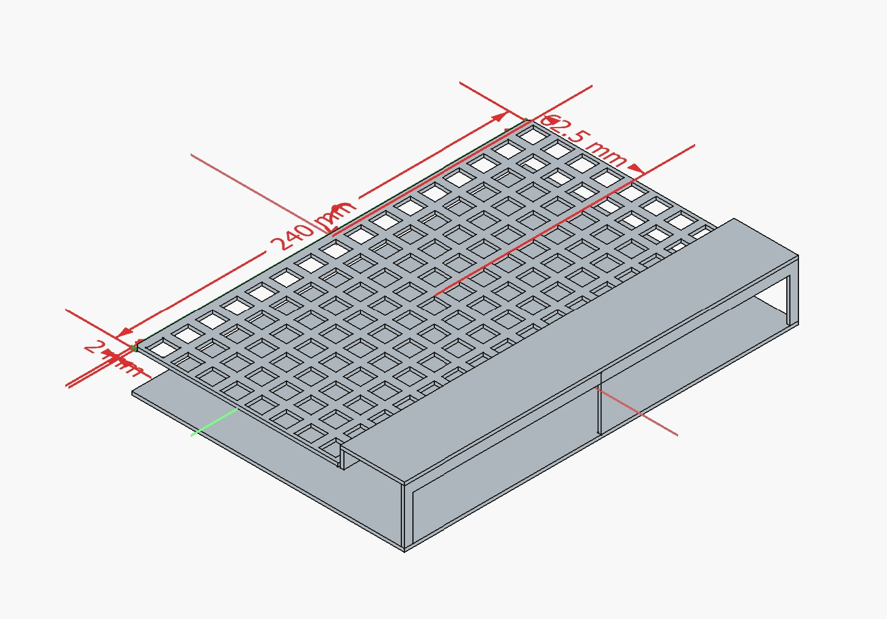

# Cyclic

##### What is this?

Cyclic is a stand-alone, 8-channel, 16-step trigger sequencer. It has 8 clock inputs to allow for independent clocking of each channel, and 8 individual trigger outputs. Additionally, it has a pair of TRS-A MIDI ports for input and output.

Cyclic is designed to be driven externally and thrives on clocks that are a bit ... weird. Because it has no real concept of time itself, you can throw whatever wonky clocks you want at it and it'll do its best to keep advancing the clock. This goes all the way up to low audio rates if you want to get particularly weird.

##### How much power does it use?

(TBC, 5v only though. Need a USB power draw tester)

##### Where does the design come from?

This one's all me, although the button pad contact pattern comes from the [Adafruit Trellis](https://github.com/adafruit/Adafruit_Trellis) repository.

##### Are there any rare/weird parts used?

Nothing super special, although the crystal and voltage regulator used with the RP2350B does need to be precisely correct. See the RP2350 design documentation for details.

##### Are there any problems with the design?

As of the initial version, most functionality works well - however, when updating the firmware the GPIO port expander ICs seem to get a little upset, and on my test PCB one of them fails to come back without a power cycle. This should be fixable by adding a trace from the RP2350B to the GPIO expanders' reset pin, and will follow in a future revision.

As of the initial version, the clocking, trigger outputs, and MIDI outputs are complete. MIDI input code does not exist yet. The firmware is also a little weird in that despite using interrupts, the GPIO expanders still seem to want to be read to keep on updating the interrupt state. Unclear if this is a firmware problem with a library or a bug with the chip.

In terms of other hardware gotchyas, the case doesn't exist yet either - there are some very rough design files for a case but these will change once the second revision exists.

Ergonomically, the button pads are raised up a little and could be placed on the "bottom" alongside the clock output sockets. Again this requires some hardware changes.

##### Do you have a BOM/Mouser cart/Tayda links?

Sorry, no. Things go out of stock so frequently it'd be a lot of work to keep these up to date. Everything in this project is easy to source though, so you should not have any trouble.

##### Can I buy PCBs or a kit?

Stay tuned. These might become something to buy eventually.

##### Other resources

(BOM, Firmware, Assembly guides to follow)

