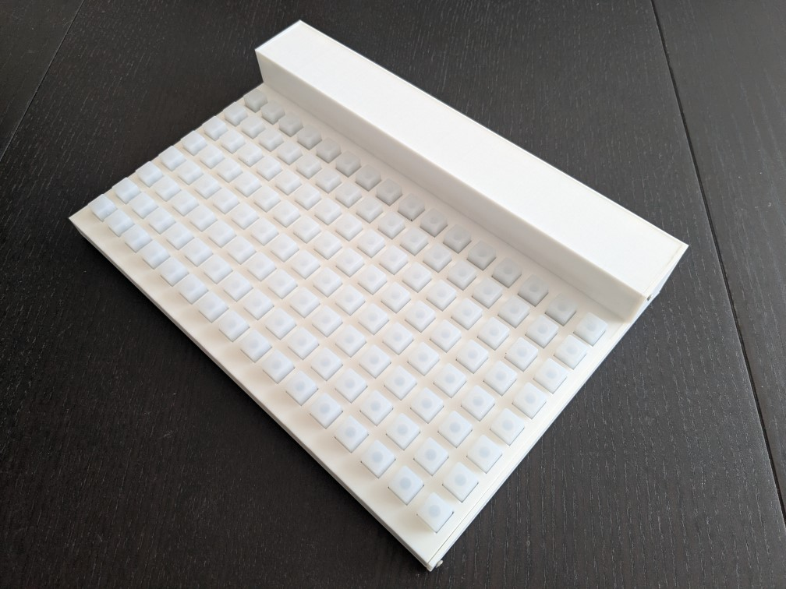

# Cyclic

##### What is this?

Cyclic is a stand-alone, 8-channel, 16-step trigger sequencer. It has 8 clock inputs to allow for independent clocking of each channel, and 8 individual trigger outputs. Trigger inputs are normalled, so if you want to, you can clock Cyclic with just one trigger. Additionally, it has a pair of TRS-A MIDI ports for input and output.

Cyclic is designed to be driven externally and thrives on clocks that are a bit ... weird. Because Cyclic has no real concept of time, you can throw whatever wonky clocks you want at it and it'll do its best to keep advancing the clock. This goes all the way up to low audio rates if you want to get particularly weird.

The minimalist design of Cyclic, stripped back to a handful of 16 step sequences, means that a lot of features found on other sequencers aren't present and that's by design. That includes resetting tracks, copy/paste, muting, on the fly configuration and other creature comforts that usually end up clouding what the sequencer is for, at least to me.

##### How much power does it use?

The LEDs in Cyclic take the majority of the power. Cyclic has both a USB-C (5v) port, and a barrel socket (Also 5v). I've been using Cyclic successfully with both an unpowered USB hub and a 5 amp 5v MeanWell supply which is almost certainly massive overkill.

##### Where does the design come from?

This one's all me, although the button pad contact pattern comes from the [Adafruit Trellis](https://github.com/adafruit/Adafruit_Trellis) repository.

##### Are there any rare/weird parts used?

Nothing super special, although the crystal and voltage regulator used with the RP2350B does need to be precisely correct. See the RP2350 design documentation for details.

The button pads are the same as the Silicone Elastomer 4x4 pads from Adafruit, although I sourced mine separately.

##### Are there any problems with the design?

As of the second revision, the clocking, trigger outputs, and MIDI outputs portions of the firmware are complete. MIDI input code does not exist yet. Connecting Cyclic to a computer exposes a configuration file which can be used to change the trigger assignments. The hardware is otherwise complete.

The 3D printed PLA case can be printed in a couple of pieces. The "bottom" half of the case consists of the bottom, sides, and rear of the case and can be printed easily on a large enough printer (250x250x250mm). The "top" half of the case is comprised of the front, button pad cover, and top socket cover. This needs to be printed stood on-end. I have not tried printing the case in materials other than PLA.

##### Do you have a BOM/Mouser cart/Tayda links?

Sorry, no. Things go out of stock so frequently it'd be a lot of work to keep these up to date. Everything in this project is easy to source though, so you should not have any trouble.

##### Can I buy PCBs or a kit?

While this is in early prototyping phase, I do have one spare set of PCBs and button pads, or I'm happy to build a Cyclic for you. At this time, please email hello@divergentwaves.co.uk for information. Cyclic may come to Reverb and Tindie in the future too.

#### Special Thanks

Thanks to [PCBWay](https://pcbway.com/) for sponsoring a portion of the PCB production for this project. I've been using them for a while now for matte black FR4 front panels for Eurorack projects and have always found them easy to work with and consistently high quality. 

The process of ordering PCBs is streamlined and quick, with PCB assembly more of a high-touch affair than some of their competition. This is often a blessing rather than a curse - catching production problems early reduces delays in manufacturing and really helps get prototypes ready sooner.

For this project, PCBWay sponsored the topmost socket PCB with PCB assembly to allow me to squeeze in a handful of resistors, capacitors, and transistors in where through-hole parts would not have fitted.

##### Other resources

(BOM, Firmware, Assembly guides to follow)

