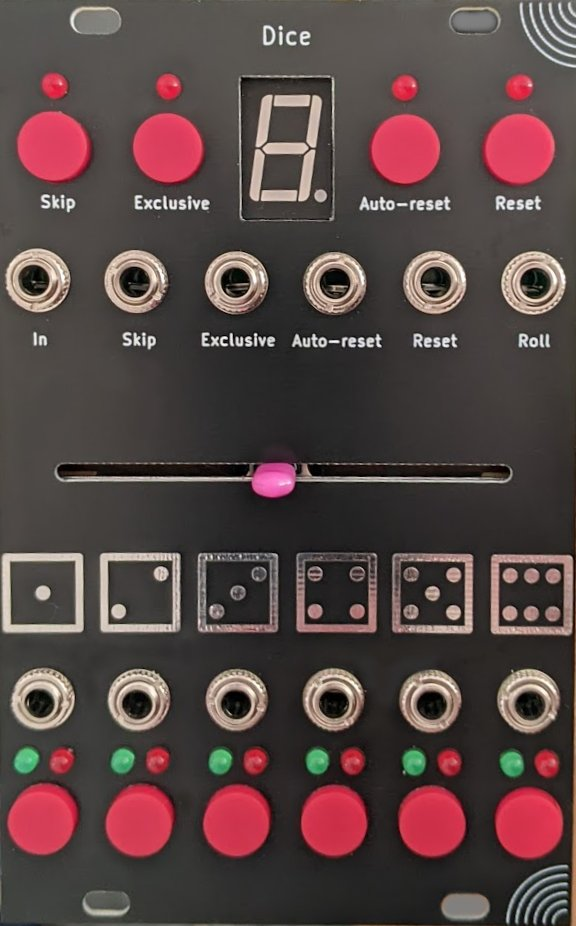

# Dice

##### What is this?

Dice is a 16hp, clickless signal router. It can also be thought of a bit like a microprocessor-controlled sequential switch with one input and six outputs. Outputs are determined by rolls of a dice, or by manually muting and unmuting with buttons.

##### How much power does it use?

As measured by the joranalogue Test 3, around 100-200 mA on +12v and 40 mA on -12v at peak. The 5v rail is unused. The exact power draw depends on how many of the LEDs are lit at any one time.

##### Where does the design come from?

Some hints taken from the DS1882 datasheet, but it's my own design otherwise!

##### Are there any rare/weird parts used?

The DS1882 audio digital potentiometer is the secret sauce that makes everything work.

##### Are there any problems with the design?

The power draw is a *little* high with many LEDs lit at high brightness.

##### Do you have a BOM/Mouser cart/Tayda links?

Sorry, no. Things go out of stock so frequently it'd be a lot of work to keep these up to date. Other than the DS1882s and Raspberry Pi Pico, everything in this project is easy to source though, so you should not have any trouble.

##### Can I buy PCBs or a kit?

Available as a [DIY Kit](https://www.tindie.com/products/divergentwaves/dice/) from Tindie

##### Other resouces:

- [Kit BOM](BOM.md)

- [Kit assembly instructions](ASSEMBLY.md)

- [Manual](MANUAL.md)

