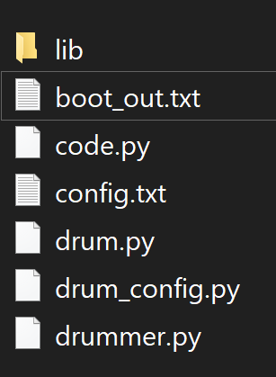

# DrumFiend - Firmware

##### Requirements

To program the DrumFiend firmware you will need:

- Teensy 4.0

- Micro USB cable. Make sure the cable is not a "charging" cable, you need data and power

- The Teensy Loader application ([Available from PJRC](https://www.pjrc.com/teensy/loader_win10.html))

- Firmware.zip in this repository ([firmware/drumfiend/firmware.zip](firmware/drumfiend/firmware.zip))

- The CircuitPython HEX file for Teensy 4.0 ([Teensy 4.0 Download](https://circuitpython.org/board/teensy40/))

##### CircuitPython Installation

*Disconnect the DrumFiend module from your modular synth before programming the Teensy!*

Plug the Teensy in to your PC. If this Teensy has never been programmed before, it should be blinking its LED every second or so.

Run the Teensy Loader application and choose File/Open Hex File, pointing Teensy Loader at the CircuitPython HEX.

Select Operations/Program to burn the HEX file to the Teensy. This can take a few seconds, and once done the Teensy will restart. If your Teensy does not restart after programming has been completed, just hit the restart button on the toolbar.The Teensy should now show up as an external hard drive, like this:

On a Mac, you should find the CIRCUITPY drive mounted automatically.

##### DrumFiend Firmware

Unzip the firmware.zip somewhere on your computer, then copy the extracted files over to the CIRCUITPY drive. You can overwrite the code.py file already present.

Once you're done, the disk's contents should look like this. You may be missing the boot_out.txt:

That's it, the DrumFiend firmware is now on your Teensy.

##### Firmware hacking

If the configuration file (config.txt) isn't enough and you want to change DrumFiend's code, try installing the Mu editor first as it does allow for some debugging workflows. Adafruit has an excellent guide to walk through this [Installing the Mu Editor (adafruit.com)](https://learn.adafruit.com/welcome-to-circuitpython/installing-mu-editor). When modifying the firmware, start with code.py and go from there.
