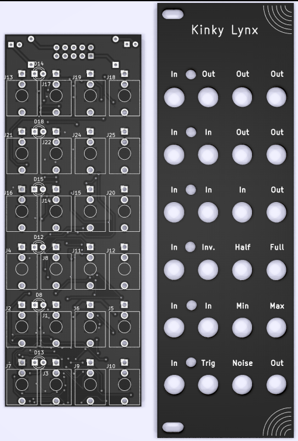

# Kinky Lynx

##### What is this?

A mashup of Mutable Instruments' [Kinks](https://mutable-instruments.net/modules/kinks/) and [Links](https://mutable-instruments.net/modules/links/) all on one board.

##### How much power does it use?

(TBC) As measured by the joranalogue Test 3, around x mA on +12v and y mA on -12v at peak. The 5v rail is unused.

##### Where does the design come from?

This is just a copy of the Kinks and Links schematics jammed together on one PCB, with a couple of very small component changes to allow for easier assembly.

##### Are there any rare/weird parts used?

All fairly common parts. Some of the capacitors are quite small (0402 sized) which will make hand soldering a challenge, I had my boards assembled by the PCB fab. I used two pin bicolour LEDs, but you can substitute them for a normal 3mm LED.

##### Are there any problems with the design?

The topmost row (One in three out) seems to pull the LED to a negative voltage when nothing is plugged in, but other than everything works well!

##### Do you have a BOM/Mouser cart/Tayda links?

Sorry, no. Things go out of stock so frequently it'd be a lot of work to keep these up to date. Everything in this project is easy to source though, so you should not have any trouble.

##### Can I buy PCBs or a kit?

Send me an email (twigathy+synth@gmail.com)...

