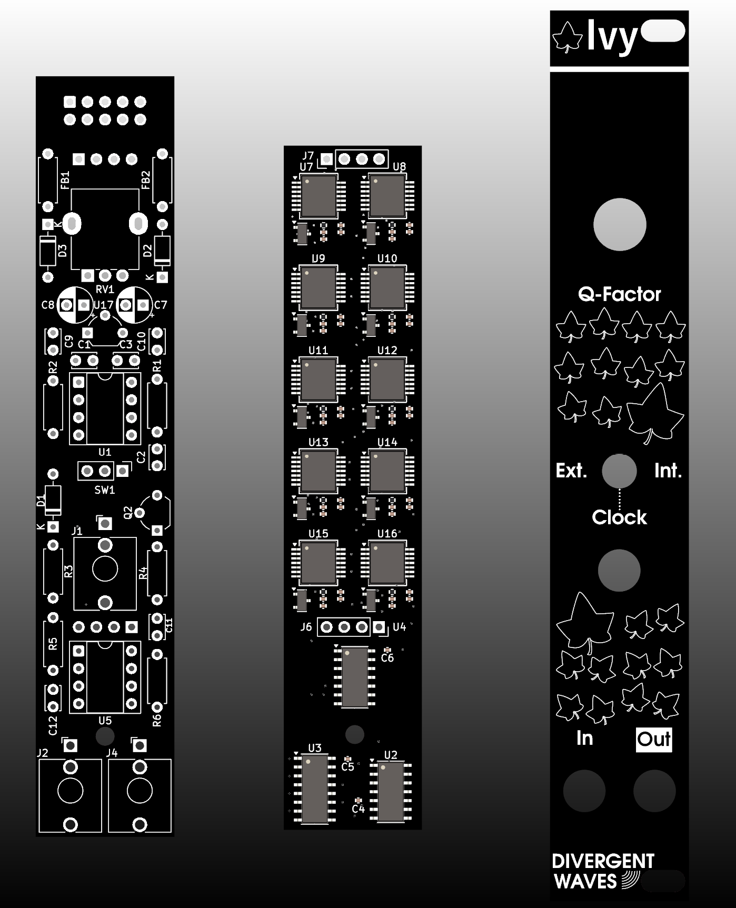

# Ivy

##### What is this?

Ivy is a phaser build around a number of switched capacitors. In some ways, it's a little bit like a strange varient of a BBD.

##### How much power does it use?

As measured by the joranalogue Test 3, around ?? mA on +12v and ?? mA on -12v at peak. The 5v rail is unused.

##### Where does the design come from?

The core circuit is based on an Elektor Magazine design from the 1970s. A copy of the article is availbe on [archive.org](https://archive.org/details/ElektorMagazine/Elektor%5Bnonlinear.ir%5D%201975-09/page/n16/mode/1up). The Eurorack specifics, along with the 555 timer to control the switching rate, are a little more original.

##### Are there any rare/weird parts used?

Everything should be reasonably easy to source, although the logic ICs are getting quite long in the tooth these days.

##### Are there any problems with the design?

(TBC after testing)

##### Do you have a BOM/Mouser cart/Tayda links?

Sorry, no. Things go out of stock so frequently it'd be a lot of work to keep these up to date. Everything in this project is easy to source though, so you should not have any trouble.

##### Other resources

[BOM](BOM.md)

