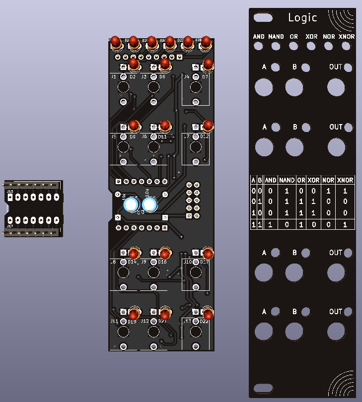
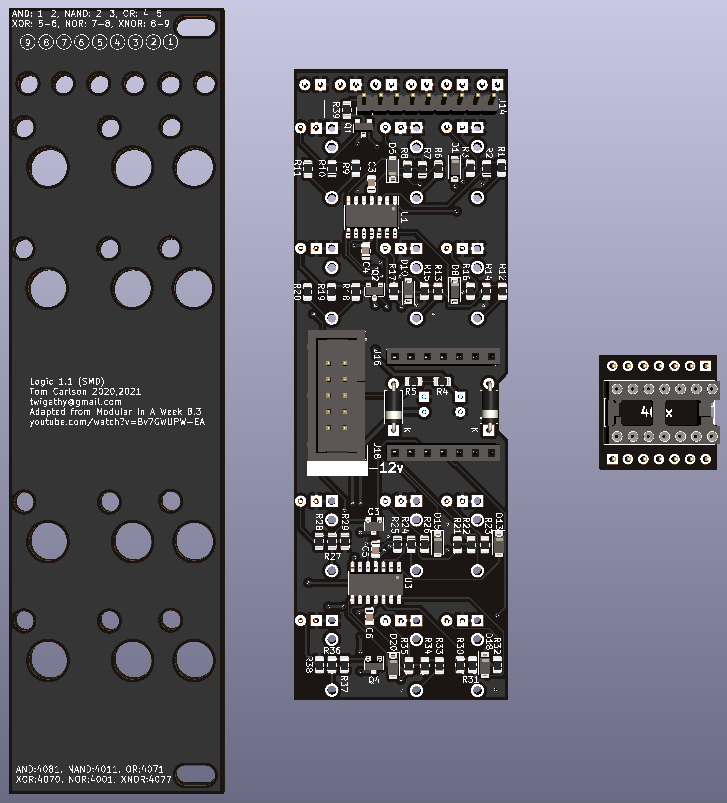

# Logic

##### What is this?

A 4-channel logic module using CD4xxx chips

##### How much power does it use?

As measured by the Joranalogue Test 3, around 50 mA on +12v and 15 mA on -12v at peak. The 5v rail is unused.

##### Where does the design come from?

Originally, this is from the Modular in a Week series on YouTube (www.youtube.com/watch?v=Bv7GWUPW-EA) by Kristian Blåsol. I tweaked the design a little and added some features such as the strip of LEDs at the top of the module, and made the swappable logic IC on a daughterboard rather than in an IC socket.

##### Are there any rare/weird parts used?

You will need to get hold of the proper kind of logic chip for the logic operation you want to support. In the one I have built, I used a CD4070 quad xor.

The design is also partially SMT for the resistors, diodes and TL074 ICs, but otherwise uses common through-hole parts.

##### Are there any problems with the design?

Nope!

##### Do you have a BOM/Mouser cart/Tayda links?

Sorry, no. Things go out of stock so frequently it'd be a lot of work to keep these up to date. Everything in this project is easy to source though, so you should not have any trouble.

##### Can I buy PCBs or a kit?

Send me an email (twigathy+synth@gmail.com)...

##### Other resources

- [BOM](BOM.md)
- [Assembly guide](ASSEMBLY.md)

