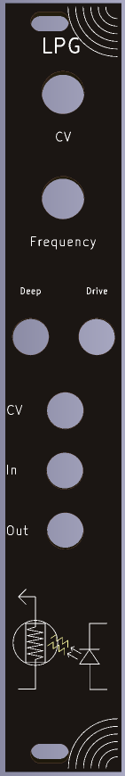
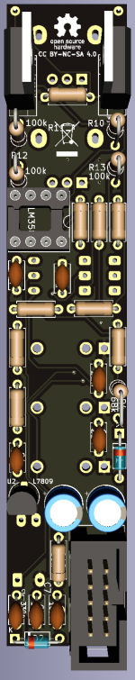

# LPG

##### What is this?

A simple 4hp Low pass gate based around vactols. It has controls for cutoff (including CV-controlled cutoff), along with some other options to colour the sound a little called "deep" and "drive". With some careful tweaking of the cutoff, plucky sort of sounds can be coaxed out of even the most noisy of VCOs.

##### How much power does it use?

This is, for whatever reason, surprisingly power hungry, taking 50mA on +12v. -12v and 5v rails are unused.

##### Where does the design come from?

LPG is based on one of the schematics from [modularsynth.wordpress.com](https://modularsynth.wordpress.com/module-diy-lpgatt/)

##### Are there any rare/weird parts used?

You'll need to pick up some Vactrols as they make the core of the Low Pass Gate!

##### Are there any problems with the design?

Input levels are cut a little, but it's not too much of a problem - signals can always be boosted again in a mixer or VCA.

The Vacrols I found on aliexpress, but they seem to have a very narrow band where they work. Either fully on or fully off which isn't quite what I expected. You might have more luck DIYing your own vactrols with LEDs, tape and a light sensor!

The text for the inputs is a little too close to the left hand edge, could probably be nudged to the right a little bit.

##### Do you have a BOM/Mouser cart/Tayda links?

Sorry, no. Things go out of stock so frequently it'd be a lot of work to keep these up to date. Everything in this project is easy to source though, so you should not have any trouble.

##### Can I buy PCBs or a kit?

Send me an email (twigathy+synth@gmail.com)...

