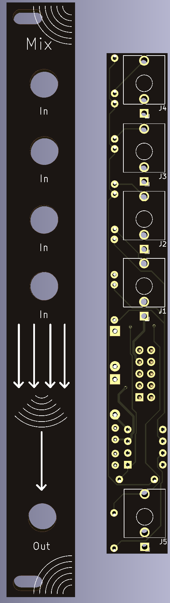

# Mix

##### What is this?

A really simple 3hp, 5-to-1 mixer. There's nothing smart in this design, just a very basic mixer that's great for audio or CV.

##### How much power does it use?

Next to nothing. As measured by the joranalogue Test 3, around 10 mA on +12v and 5 mA on -12v with all 4 inputs going and the output plugged into something. The 5v rail is unused.

##### Where does the design come from?

The schematic is based on the [CGS04](https://elby-designs.com/webtek/cgs/cgs04/cgs04_mix.html) mixer, skipping the attenuator option to save on panel space

##### Are there any rare/weird parts used?

Nope! The rarest thing you'll need is the TL072 opamp.

##### Are there any problems with the design?

If multiple signals are input together and they add up to >10v or so, the signals start to clip. Usually this isn't a problem, but mixing several audio sources together for example can be problematic.

This is also not a *precision* mixer so while you could use it for mixing pitch voltages it's not the best tool for that job.

If I were to do a Mix v2, it'd include LEDs for each input, the output, and perhaps a "clip" LED to show when the signals being summed are a little too hot. That's a lot of complexity though compared to this extremely simple design!

Finally, this is one of the first designs I ever made - while there is reverse polarity protection, there's no capacitors at the +/-12v inputs.

##### Do you have a BOM/Mouser cart/Tayda links?

Sorry, no. Things go out of stock so frequently it'd be a lot of work to keep these up to date. Everything in this project is easy to source though, so you should not have any trouble.

##### Can I buy PCBs or a kit?

Send me an email (twigathy+synth@gmail.com)...

(Add some rendered images of the panel and back of PCB(s).)

