# Logic - Assembly

##### Special note for v1.1 - SMD

There are a couple of errors in this PCB, but nothing that can't be rectified. Please read the guide fully before starting - you may wish to make the trace cuts before assembling everything - however, the traces to be cut are still accessible once assembled.

##### Getting ready

First, gather together the tools you are going to use to assemble the module. At the bare minimum you should be able to do this with just a soldering iron, solder, and side cutters - but there are some additional tools that will make life easier:

- ESD-safe tweezers
- Flux pen
- PCB vice or helping hands to hold the PCB in place
- Fan and absorbent material to get rid of solder/flux fumes
- Beefier cutters for chopping up female headers
- Overhead lighting
- Silicone mat or scrap piece of wood to protect whatever surface you're soldering on
- Solder dispenser
- Tub to hold parts ready for soldering
- Multi-meter for continuity testing

Take a look through the bill of materials and make sure you have all the parts. I like to organise mine by putting them into tupperware or take-away boxes - if you do, just don't use them for food again afterwards.

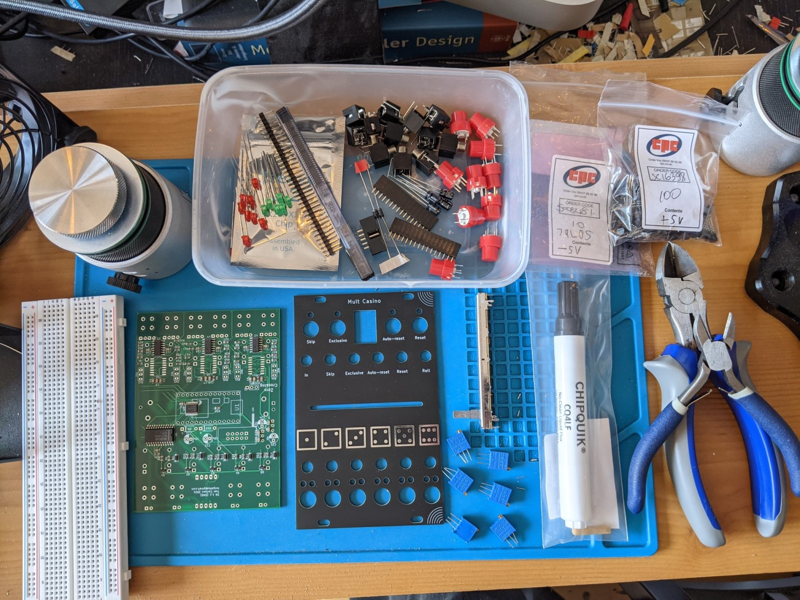

##### Preparing the Teensy

Cut or snap a pair of male headers to size and fit them to the Teensy, but don't solder them just yet. You'll also want to find the female headers too.

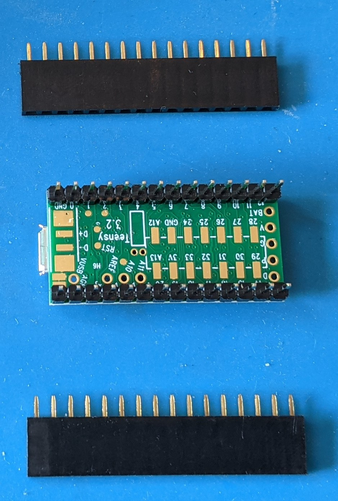

Place the female headers across the male ones. This helps keep the headers aligned while you're soldering. Flip the Teensy and headers over, solder one pin on the top row and one on the bottom row before checking that everything looks straight, then solder the rest.

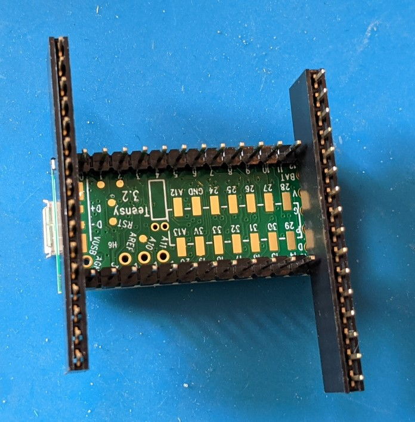

Remove the female headers, they will be used a bit later on to mount the Teensy to the main board.

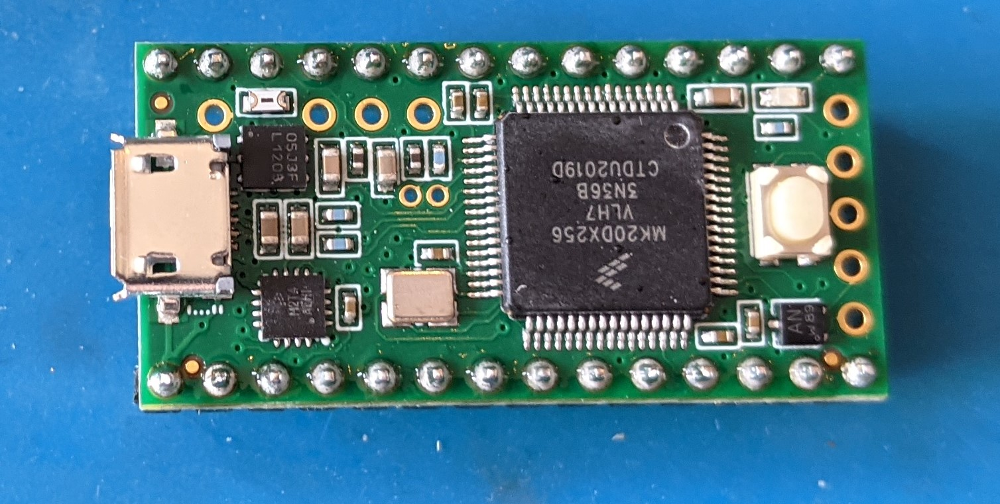

##### Digipots

Find the DS1882 digipots and place them somewhere off to the side of the board. The text should be at the top of the chip, and the pin 1 indicator top-left. Add a little solder to one of the pads. This will help keep the chip in place as you solder the rest of the legs.

There are countless guides online as to how best to solder SMT parts. For me, the "drag solder" method worked best, along with applying lots of washing-not-required flux when cleaning up. Here's a picture from half-way through. The pads on the board for the DS1882 are quite wide, so there's a decent margin for error left and right but not up and down.

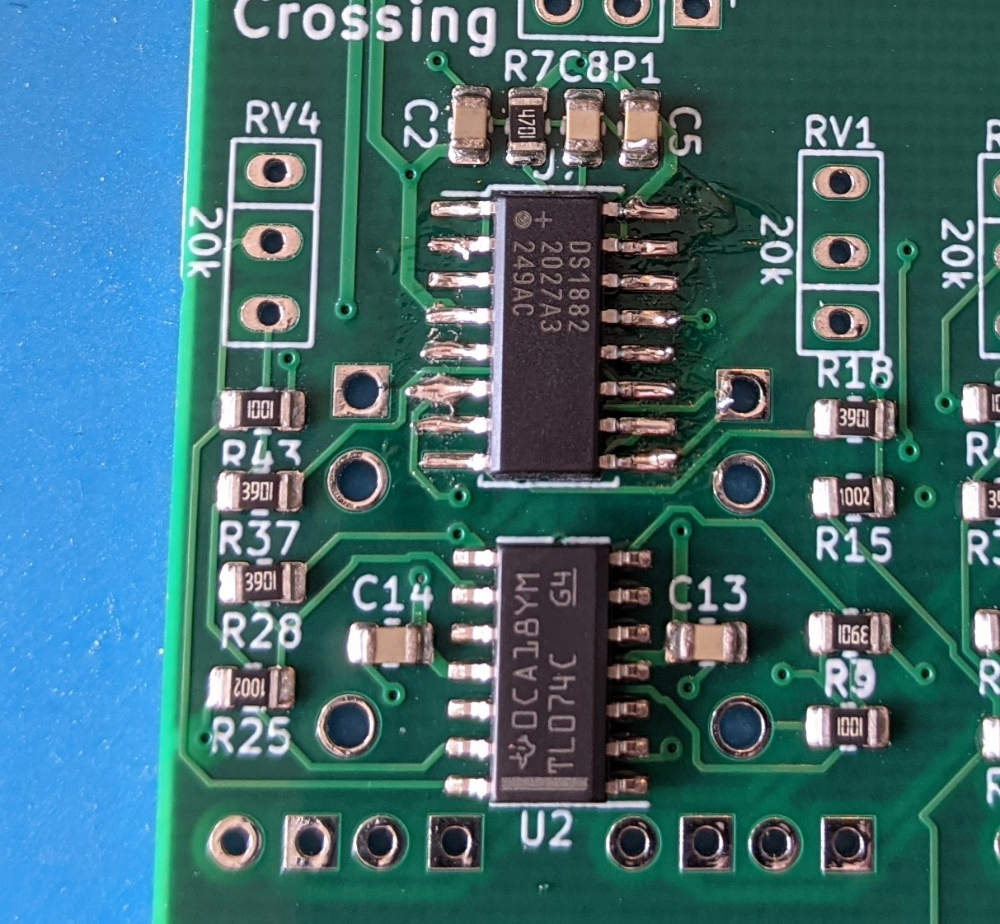

Repeat for the other two digipots, and you've got the hardest part of this whole build done!

##### Power

Now we're onto the through-hole parts, starting with the lowest and going higher. First, find the two reverse-polarity protection shottky diodes. These are polarised parts, make sure the line points right. Flip the board over and solder from the back.

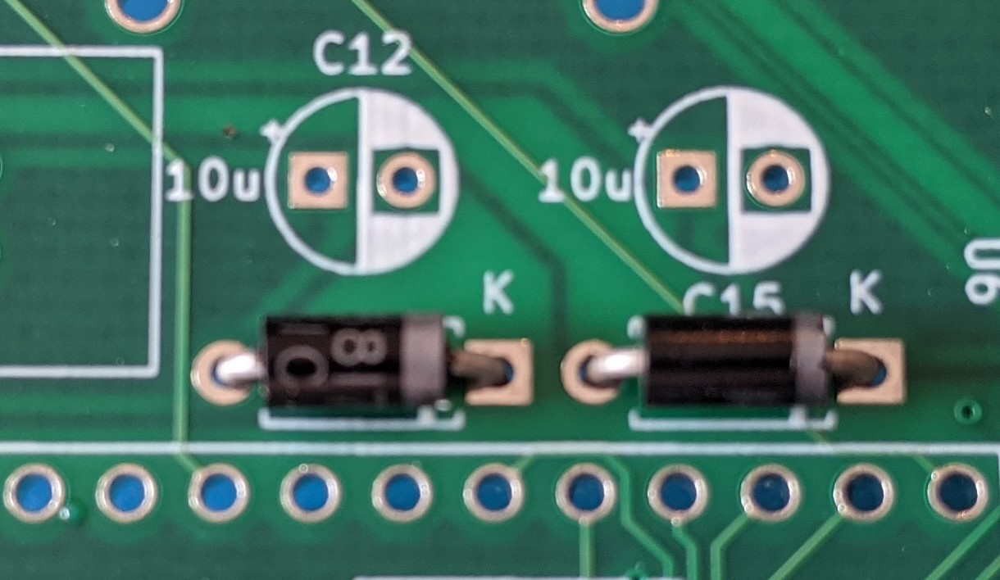

Next up are the +5v and -5v regulators. These supply power to the DS1882 chips, and the Teensy. On the v1.1 board, these parts have silkscreen on the front side of the PCBs, but you can also place them on the rear side as I'm doing here. Just make sure to get the pins lined up correctly! Depending on your regulators, you might need to splay the leads out a little in order to get them to fit.

Next up are the 10uF electrolytic capacitors. These are polarised parts, make sure that you have them the right way around with the negative indicator on the capacitor matching the silkscreen on the board.

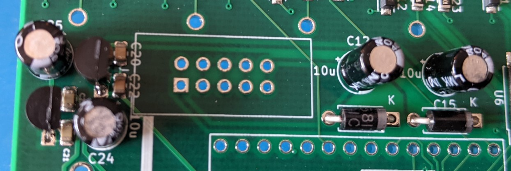

Now the 2x5 power header. This is another polarised part - make sure the -12v silkscreen matches up with -12v on the power header. Grab a Eurorack power cable to double check!

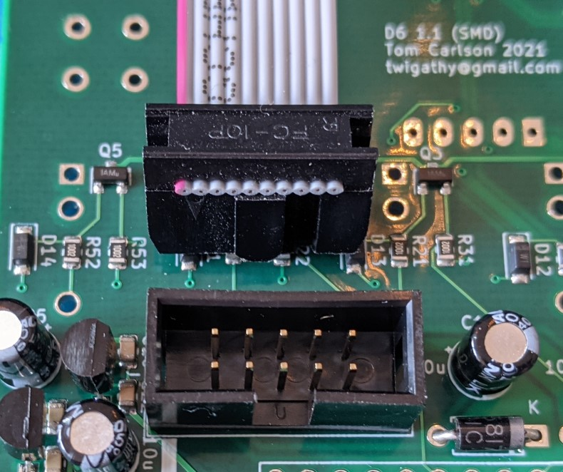

##### Teensy Part 2

Take the female headers and cut them to size, add the male headers to them and add to the PCB, making sure the silkscreen lines up with the USB port location on the Teensy.

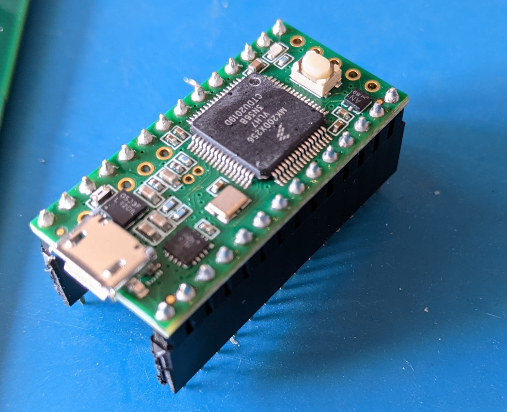

Solder a pin or two of the headers and just make sure that everything looks straight. Once you have two pins on both headers soldered, you can remove the Teensy for now which should make assembly a little easier.

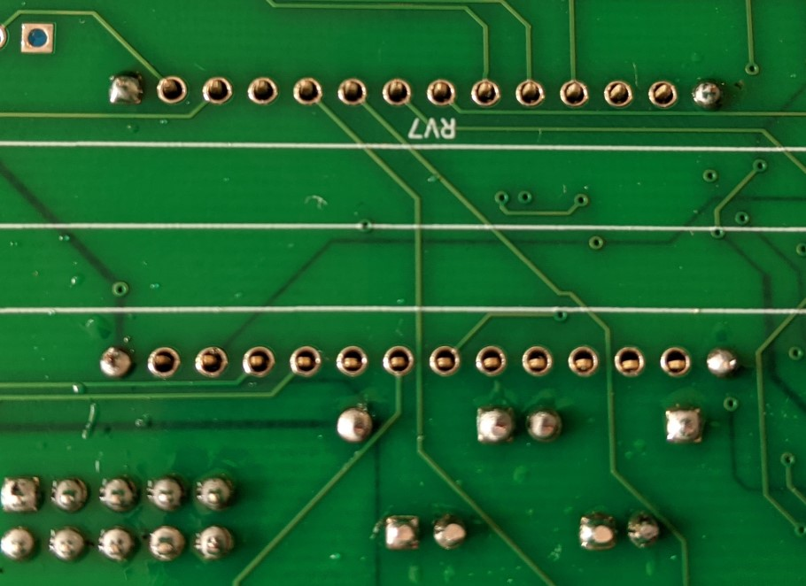

Next up, cut a male 3-pin header to size and add it to the Zero Crossing header, soldering from the back. This isn't used in the current firmware, but may become useful in the future.

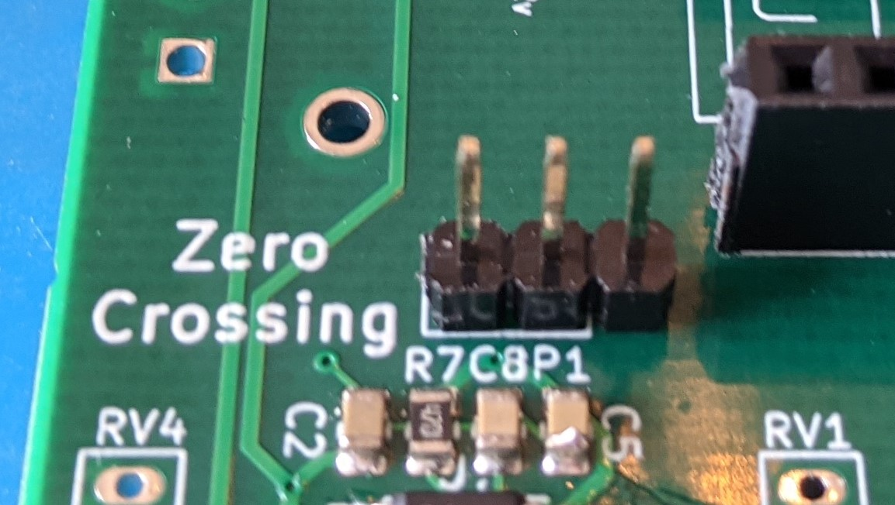

##### Trimmers

This build makes use of several trimpots which help to make sure the output voltage is the same as the input voltage. Each one controls one of the six outputs. Place the trimmer on the left hand edge, solder it, then do the same for one of the right hand edge too. Now add the other four and solder them too. Having two on opposite edges should make the board stand up on its own a bit easier.

When soldering these parts, it's worth soldering one pin and flipping the board over to check whether the trimmer is flush with the board and standing up straight.

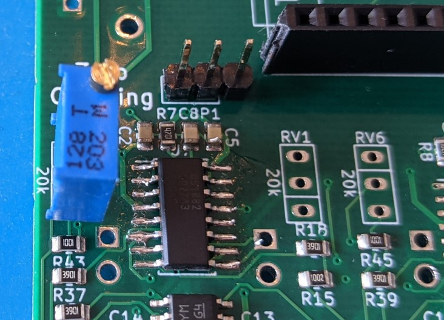

At this point, everything but the front panel components are done!

##### LEDs, sockets, and buttons

It might be tempting to stuff all the front panel parts now but try and resist! I found it easiest to solder just a couple of the jacks first which can help to hold the front panel in place while the rest of the parts are soldered. So, to start with add four jacks and the 7-segment LED display. Carefully thread the front panel over the top of the jacks, adding washers and nuts to hold the jacks to the panel. Wiggle the 7-segment display so that it's as close to the panel as possible while still leaving a little bit of leg showing out the board of the board. Flip the board over and solder just these four jacks and the 7-segment display.

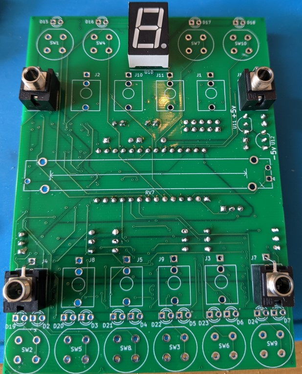

Next, take the washers and nuts off the four sockets, add the rest of the front panel components except for the fader in the middle. For the LEDs, these are a little nonstandard in the v1.1 boards - the polarity is indicated wrong in the silkscreen and you should put the flat part of the LED towards the *round* hole rather than the square hole as normal. If you're not sure about this, you can at this point forgo soldering the LEDs and instead leave them loose/unsoldered - they'll light up during the startup sequence of the module later.

For the buttons, make sure the flat edge of the button matches the silkscreen on the board. Getting this wrong can mean the button is constantly pressed! When soldering the buttons, I found it best not to press too hard when soldering as otherwise the buttons can end up at slightly different heights.

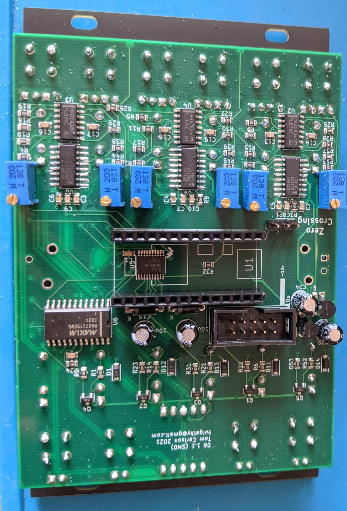

Undo the nuts for the jacks (Again! Sorry!) and add the fader. It should drop neatly into the holes and can only go one way around. To keep the fader from popping out its holes when the board is flipped over, I found it easies to add a spacer - in this case a scrap bit of cardboard.

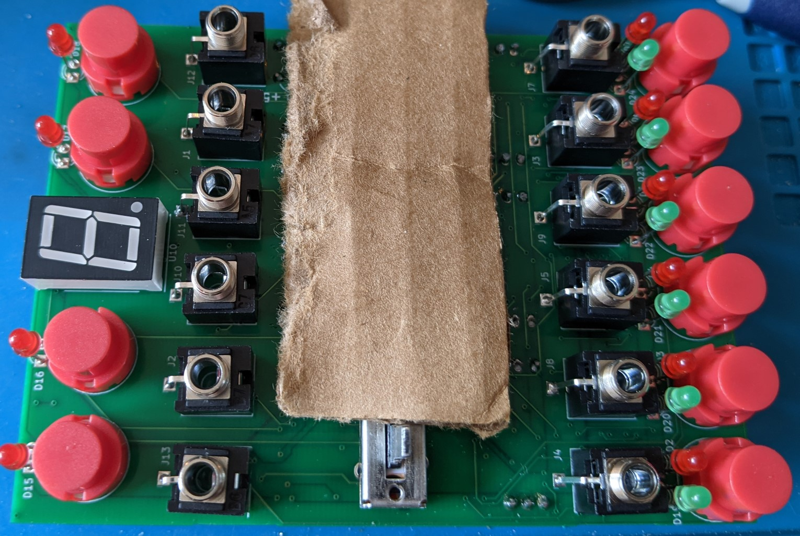

Once again, carefully thread the panel over the jacks, LEDs, fader and buttons and solder the fader from the back. Once you have one pad soldered, try sliding the fader back and forth to make sure it's all straight. When you have a couple of pads soldered the cardboard spacer can be removed.

##### Fixes for PCB errors

Unfortunately, as in all prototypes, this module isn't perfect! Two of the pins for the Teensy need to be swapped over (This can't be done in the software as the pins are not all analogue-capable). To do this you will need to cut a couple of traces, cuts indicated in red. Check continuity between the button and the pin 5 from the top-right, and between the fader and the pin 3 from the bottom-right - if you've cut correctly, there should be no continuity.

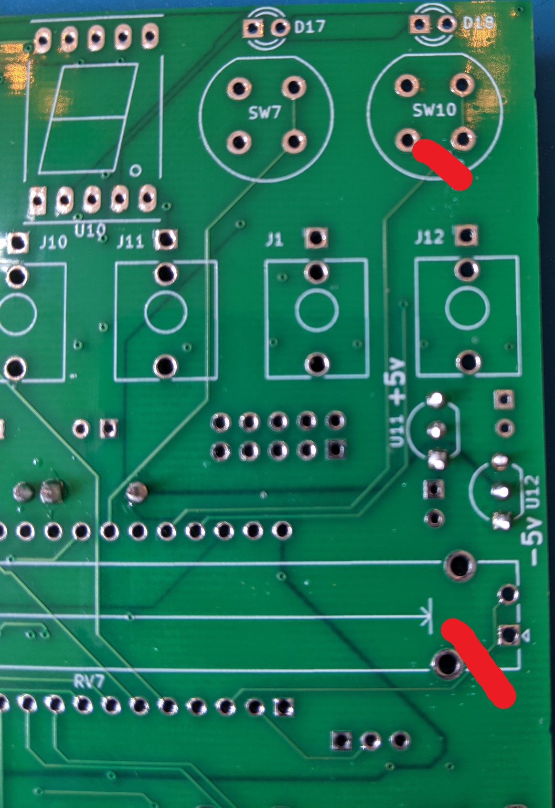

Add one wire to the bottom-right pin as shown. This should connect to the button in the top-right that you cut the trace to.

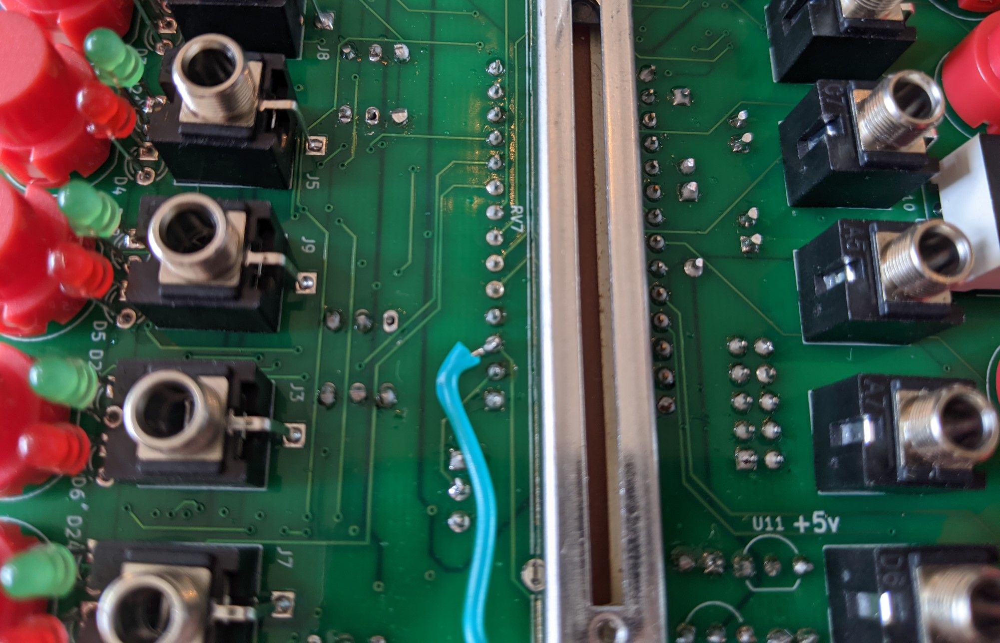

Add a second wire from pin 5 top-right of the Teensy to the small, round pad of the fader.

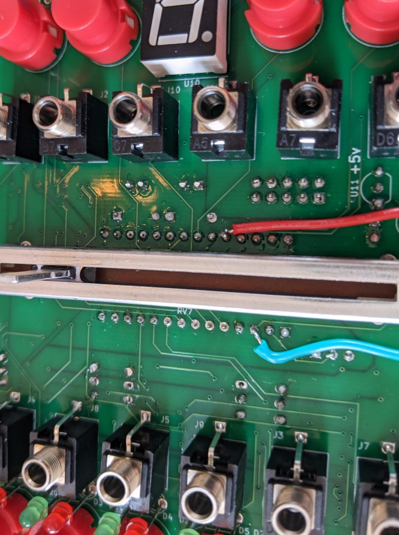

Now you can check continuity again - basically verifying that the two pins on the Teensy have been swapped over.

I routed the cables to the side of the module, but as the logic PCB is as wide as the panel this means you can't always fit other modules right up against it - you might want to try going over the top or bottom edge of the module instead.

##### Finishing off

Now that everything is soldered and you've made the fixes (For PCB v1.1), it's time to get this thing powered up!

First, connect the Teensy up to your PC or Mac and load the firmware onto it. The "Teensy Loader" program is good for this. You might find you need to press the button on the Teensy to get it to react to firmware updates.

Once flashed, carefully place the Teensy onto the female headers soldered earlier.

Now run a continuity check between the 12v, ground and -12v lines for the power connector. If there is continuity between any of these you probably have a short and will need to check your soldering carefully!

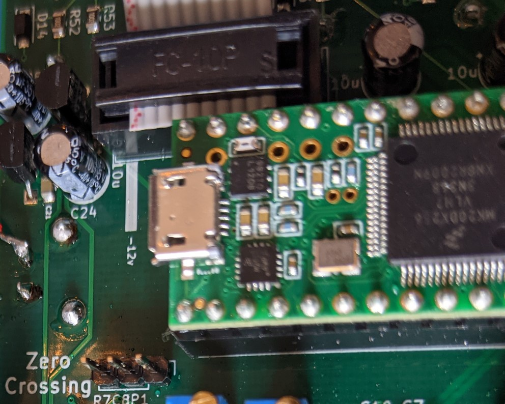

##### Calibration

This isn't totally necessary, but if you want to make sure the outputs for the module match the input then you can do the following:

- Feed a known voltage into the input. I have a Mordax Data which is great for this kind of thing. You could also use a Keyboard with a v/oct output.
- Plug a cable into one of the six outputs and use the button underneath it to activate the output. You can now either measure the voltage on the cable with a multimeter, or plug it into something to do that for you
  - If the voltage going in doesn't match the voltage going out, fiddle with the trimmer until it does
- Repeat this for the other five outputs

##### Usage

Here's a short video about the different features: https://www.youtube.com/watch?v=_Xjpsq-Pyzg