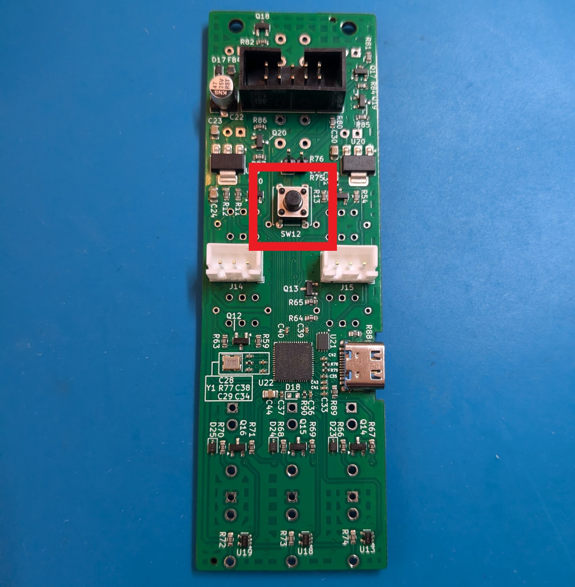
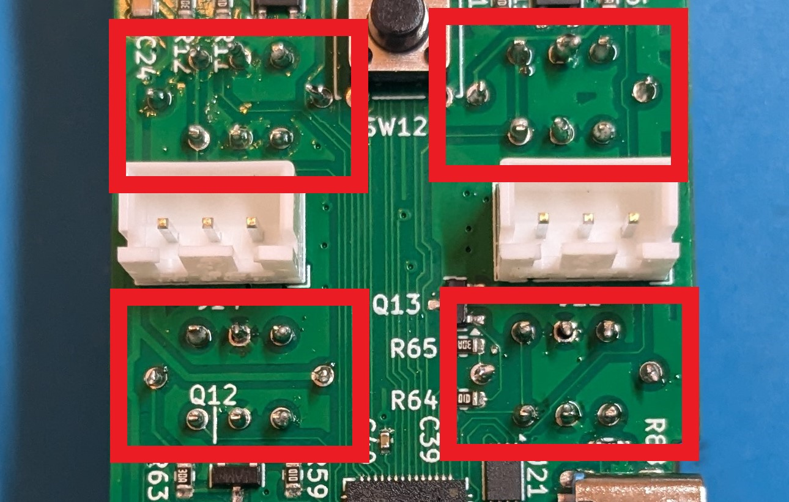

# Oak - Assembly

##### PCB Versions and kits

PCB version 1.0 - Initial prototype, no mounting holes

PCB version 1.1 - Mounting holes for front panel screws

##### Getting ready

First, gather together the tools you are going to use to assemble the module. At the bare minimum you should be able to do this with just a soldering iron & solder - but there are some additional tools that will make life easier:

- PCB vice or helping hands to hold the PCB in place
- Fan and absorbent material to get rid of solder/flux fumes
- Overhead lighting
- Silicone mat or scrap piece of wood to protect whatever surface you're soldering on
- Solder dispenser
- Tubs to hold parts ready for soldering
- Multi-meter for continuity testing

Take a look through the bill of materials and make sure you have all the parts. I like to organise mine by putting them into tupperware or take-away boxes - if you do too, just don't use them for food again afterwards.

##### Rear components

Start by placing the two JST-XH 3 pin headers. The orientation matters here, make sure to follow the silkscreen on the PCB to get them the right way around. Solder a single pin on each and check the headers are flush with the board before soldering the other two.

Next, find the 2x5 shrouded header and place that on the PCB. As with the JST-XH headers, follow the silkscreen on the PCB to get the power header in the right orientation. Solder a single pin and check the header is flush with the board before soldering the remaining pins.

Place the 2-pin 2.54mm header and, once again, just solder one pin and check before soldering the other. This header can be a little fiddly to get oriented perfectly vertically.

With everything else on the rear of the PCB soldered, add the snap-in button. The button is slightly longer on one edge, make sure you get it the right way around. Once you're happy that it's flush with the PCB, solder the legs in place.

##### Placing front panel parts

With all the rear parts soldered, it's time to move to the rest of the build. For this portion of the build, <u>do not solder</u> until all the parts are placed otherwise there's a good chance the buttons won't be perfectly lined up with their holes in the panel!

Take the two standoffs and, using the hex screws, screw them to the front of the PCB from below.

Place the Thonkiconn mono sockets but <u>do not solder</u> them in place yet.

Next, place the four LED buttons. These buttons have a small mark which will match to a dot on the PCB silkscreen - this mark should be on the right hand side.

Place the two round buttons, making sure to match the silkscreen on the PCB with the shape of the button. One edge will be flat compared to the other three. This flat edge should be pointed to the top of the PCB.

Finally, add the LEDs. These should be placed with the long leg in the round hole.

##### Soldering front panel parts

Thread the front panel over the <u>unsoldered</u> front panel parts. Add washers and nuts to a couple of the Thonkiconn sockets, and add screws to the standoffs. This should make the whole thing a little more stable, allowing the assembly to be flipped over ready for soldering.

Now it's time to solder the front panel parts.

Start with the Thonkiconn sockets at the bottom left and right soldering one pin only, making sure the Thonkiconn sockets are flat to the PCB. Flip the whole thing over and check that the buttons still have a good action and aren't rubbing on the panel. Once you're happy, solder the rest of the Thonkiconn pins. At this point, the panel and rear PCB are securely held together.

Moving up the rear PCB, solder the four LED buttons. It's especially important for these buttons that the alignment is good - solder a single pin on each button before testing the buttons and soldering the rest of the pins. These buttons have eight pins each to be soldered.

Solder the four-pin buttons, once again checking the button action after soldering one pin. You may need to rest the buttons on something to get them at the right height.

The last parts to solder are the LEDs. Double-checking the polarity (Long leg to round hole), and making sure the LEDs are pressed through the front panel appropriately, solder them in place. Do check the height of the LEDs after soldering a single pin to make sure you're happy with how each LED looks (Poking through the front panel is my  personal preference).

Once soldered, trim the leads.

##### Front panel hardware

Add the rest of the washers and nuts to the Thonkiconn sockets and you're done!

##### Check for shorts

Check for short circuits by probing the power header with your multimeter. There should be no continuity between +12v and ground, -12v and ground, or +12v and -12v.

##### Firmware

To flash Oak's RP2040, follow the [FIRMWARE](FIRMWARE.md) guide. If you have an older Sycamore revision, you may also need to update the firmware for Sycamore for the two modules to talk to each other.

###### Testing

No calibration is needed.

Ensuring the power is turned off first, plug the module into your Eurorack. Connect Oak to Sycamore with the included 3 pin JST-XH cable, and turn on power to the rack.

Send a clock to Sycamore to start the sequencer. Send triggers to the inputs of Oak. Scale Shuffle should cause a little dot to appear on Sycamore's LED display, Scale Reset will clear the dot.

Check the buttons all work - the two at the top of Oak should do the same job as the trigger inputs for Scale Shuffle and Reset Loop. The four in the middle of the module will light green as they are pressed.

See [MANUAL.md](MANUAL.md) for how to use the module.