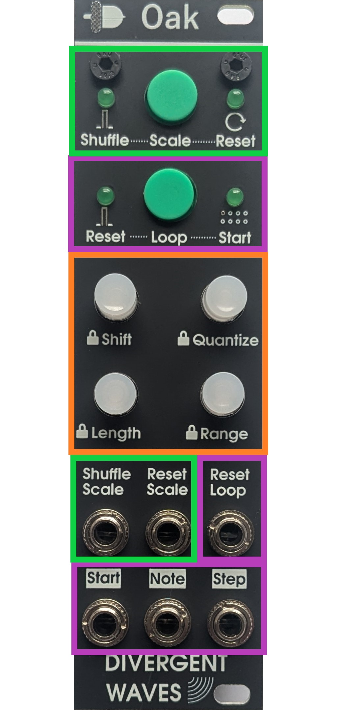

# Oak - Manual

For a quick overview of the module, see the [Oak Overview](https://www.youtube.com/watch?v=Zvx0Bf0yH-E) video.

##### Installation

Make sure your modular system is powered off. Connect the power cable to the back of Oak, and connect the 3-pin cable between Oak and Sycamore. You may use either of the two 3-pin sockets of Oak to connect up to Sycamore.

##### The basics

Oak is an expander for Sycamore, a dual random quantized looping sequencer. Oak has three functions:

- Parameter locking for Sycamore's main parameters (Orange section)

- Trigger outputs as the sequence advances, and a reset input to go back to the start of the loop (Purple sections)

- Scale shuffling and manipulation (Green sections)

##### Parameter locking

The four central buttons allow for locking in Sycamore's Shift, Quantize, Length, and Range parameters. This includes both the knob position and CV control. When locked, the buttons are lit green. Unlocked, the buttons are unlit.

You can use these lock buttons to fix a parameter in place - for example, if you want to make sure the length of the sequence doesn't change over time even with CV coming in, lock the Length parameter.

#### Loop trigger inputs and outputs

Oak features three different trigger outputs. These output after Sycamore moves the sequence on.

The Start output outputs a short trigger when Sycamore's sequence is back at step 1. This can happen after a reset, or after the loop has completed.

Step outputs a short trigger once Sycamore moves the sequence on by one step. This is best used for triggering envelopes or other modules, safe in the knowledge that Sycamore has updated the note. Think of it like a duplicate of the clock input for Sycamore, but with a short (0-4ms) delay.

Note is very similar to step, outputting a short trigger when Sycamore's sequence advances, but only when the note changes too. For example, if Sycamore is outputting C1, C1, D1 then only two triggers will be output by Sycamore. Here's a short sequence which shows the Start, Note, and Step outputs.

|       | C1  | C1  | D1  | E1  | E1  |
| ----- | --- | --- | --- | --- | --- |
| Start | X   |     |     |     |     |
| Note  | X   |     | X   | X   |     |
| Step  | X   | X   | X   | X   | X   |

Triggers are output for approximately 50ms at 5v.

Oak also has a Reset trigger input. Send a trigger to the Reset input to, at the next step, move Sycamore back to the first step in the sequence. Pressing the loop input button will also move Sycamore back to the first step.

LEDs next to the Loop button show when the loop has had Reset triggered, and when the loop hits the first note in the sequence.

#### Scale manipulation

Sycamore allows for shuffling the current scale, changing which notes can appear when the Quantize knob (Combined with its CV input) are less than fully clockwise. Oak breaks out both Scale Shuffle and Scale Reset into two trigger inputs.

Scale Shuffle takes the current scale and moves around the ordering, while Scale Reset changes the scale back to ordered. Remember that the scales in Sycamore are already ordered to make chords and interesting collections of notes - but do include all the notes in the scale. 

For example, here's the notes a C major scale, as Sycamore understands it. With Quantize knob set to include the first three notes, Sycamore will quantize its random values to a C major chord (CEG). Shuffling once re-arranges the notes in this case giving a G major triad (GBD). Shuffling produces different results every time. Multiple triggers to the Shuffle input should shift the notes being used around and change the melody, sometimes quite significantly, but keeps the structure of ascending/descending notes the same.

| Original | Shuffle | Reset |
| -------- | ------- | ----- |
| C        | D       | C     |
| E        | G       | E     |
| G        | B       | G     |
| A        | C       | A     |
| D        | E       | D     |
| F        | F       | F     |
| B        | A       | B     |

As well as the two trigger inputs, Oak also has a dedicated button for shuffling the scale.

LEDs next to the Scale Shuffle button show when the scale has been shuffled or reset.