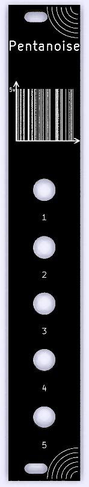
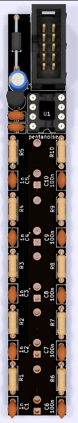

# Pentanoise

##### What is this?

A 3hp, 5-channel white noise generator based on the ElectricDruid 'Pentanoise' chip. Hence the name. The noise output is binary (0v or 5v), so you may need to run the outputs through a slew limiter, attenuate, or do something else in order to make use of them. Different modules react differently to rapidly changing digital noise. As noted in ElectricDruid's Pentanoise datasheet this binary nature does mean it won't work with a sample and hold.

Regardless, Pentanoise is also pretty good as a noise source to make cymbals, hi-hats etc. when paired up with a VCA and ADSR and that's mostly what I've used it for so far.

##### How much power does it use?

Next to nothing. Less than 5mA on 12v, -12v is unconnected, 5v is unused.

##### Where does the design come from?

The schematic is basically just the datasheet redrawn - See the ElectricDruid Pentanoise page for details (https://electricdruid.net/product/pentanoise-noise-generator/).

##### Are there any rare/weird parts used?

Yes, you'll need a Pentanoise chip - or some way to burn the Pentanoise code to a chip yourself. I would strongly encourage you to buy from ElectricDruid to support their work, though.

##### Are there any problems with the design?

Nope, this one is nice and simple and works perfectly!

##### Do you have a BOM/Mouser cart/Tayda links?

Sorry, no. Things go out of stock so frequently it'd be a lot of work to keep these up to date. Everything in this project is easy to source though, so you should not have any trouble.

##### Can I buy PCBs or a kit?

Send me an email (twigathy+synth@gmail.com)...

