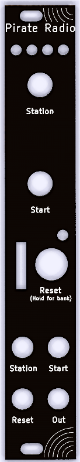

# Pirate Radio

##### What is this?

This is a panel for the Radio Music module from Music Thing Modular. Designed to match the style of the rest of the DIY panels in my rack.

##### Where does the design come from?

Essentially, this is the Radio Music panel, but modified a little - Radio Music's github is the original source (https://github.com/TomWhitwell/RadioMusic). While you _could_ DIY both the panel and the PCBs, I'd strongly recommend supporting Thonk & Music Thing Modular by buying a PCB set instead (https://www.thonk.co.uk/shop/radio-pcb/).

##### Are there any rare/weird parts used?

Not in the panel specifically (It's just a PCB after all), but the little vertical MicroSD card socket might be hard to come by. Thonk's PCB sets include the socket, so no hunting around needed.

##### Are there any problems with the design?

The hole for the button was a little bit small making it quite a tight fit - for my panels, I had to file the insides of the hole just a touch. However, I prefer a tight fit, so don't see this as a huge problem!

##### Can I buy PCBs or a kit?

Send me an email (twigathy+synth@gmail.com)...

