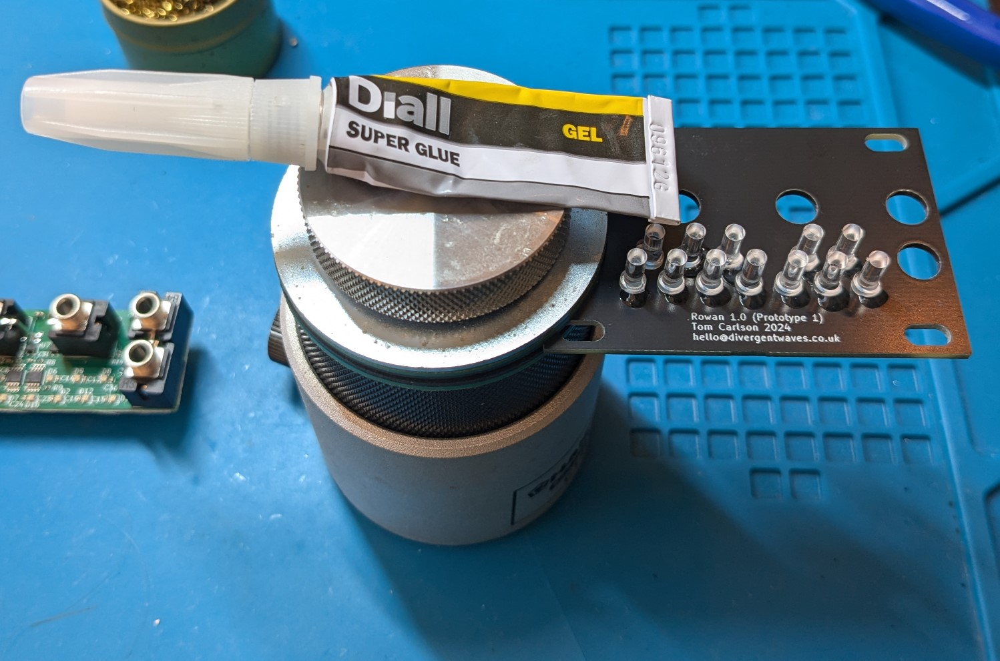
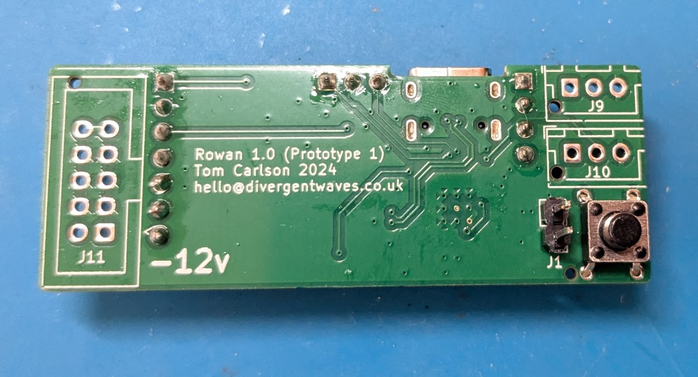

# Rowan - Assembly

##### PCB Versions and kits

PCB version 1.0 - Initial prototype

##### Getting ready

First, gather together the tools you are going to use to assemble the module. At the bare minimum you should be able to do this with just a soldering iron & solder - but there are some additional tools that will make life easier:

- PCB vice or helping hands to hold the PCB in place
- Fan and absorbent material to get rid of solder/flux fumes
- Overhead lighting
- Silicone mat or scrap piece of wood to protect whatever surface you're soldering on
- Solder dispenser
- Tubs to hold parts ready for soldering
- Multi-meter for continuity testing

Take a look through the bill of materials and make sure you have all the parts. I like to organise mine by putting them into tupperware or take-away boxes - if you do too, just don't use them for food again afterwards.

##### Preparing the front PCB

From the factory, the front PCB comes with some extra material which needs removing. Gently break away the scored material on the top, bottom, left and right sides.

##### Headers and sockets

Prepare the three header and socket pairs by slotting them together.

Stack the top and bottom PCBs on top of each other, with the headers in-between. On the top-most PCB, the parts and silkscreen face up. The bottom PCB should have the power header, and JST headers, with the SMT parts facing upwards on the inside of the PCB sandwich.

Solder a single pin on the back side, and check that the boards are parallel.

Carefully flip the assembly over and solder a single pin on the front side, once again verifying that the boards are parallel.

Once you are happy with the alignment of the two PCBs, solder the remaining pins on the front and back side. It is very important to make sure the front pins are soldered correctly at this point, they are a little difficult to get to once the Thonkiconn audio sockets are in place!

Separate the top and bottom boards once done.

##### Preparing the panel

Fit the light pipes into the panel. These are a press-fit part that have very tiny teeth which should bite into the PCB material a little, however if you want to make absolutely sure they do not come loose, use a little superglue or other adhesive to fix them in place. This is an optional step.

If you do decide to glue the light pipes in place, make sure not to get any glue on the lens or the flat edge along the bottom of the light pipe as this will make the light pipes look a little cloudy. If using glue, be sure to let it cure/dry before proceeding.

##### Adding sockets

Place the six Thonkiconn sockets into the front PCB. For the left and right pairs of sockets, the ground pins need to be bent out of the way a little. This is quite a tight fit, but with some gentle persuasion the ground legs should go into the holes.

Carefully slide the front panel over the sockets and use some washers and nuts to secure everything.

Solder the Thonkiconn sockets, one pin on each socket first to check that the sockets sit flush with the PCB. For the left and right-most sockets, this might take a little of wrangling! Once you're happy with the alignment, solder the remaining the pins.

##### Finishing the rear PCB

Place the 2-pin header into the space on the PCB. Carefully turn the board over and solder just one pin, taking care to get the header as flush with the PCB as you can get it. This might be a little tricky, you can rest the 2 pin header in some foam or otherwise support it a little. Once you're happy with the alignment, solder the other pin.

Next, place and solder the button. Note that on the Prototype 1 PCBs, the silkscreen is on the wrong side.

The JST headers are next. Making sure that the silkscreen and JST headers match up, place one and solder a single pin. Check the header is flush with the PCB, pressing the header flush while heating the pin if not to get the header nice and level. Once you're happy, solder the remaining two pins. Then repeat for the second header.

Finally, place and solder the power header, paying attention to the silkscreen for the cutout. Once again, solder a single pin and check the header lies flush with the PCB before soldering the rest of the pins.

##### Final assembly

Take the two halves of Rowan and fit them together. Do make sure the headers and sockets are lined up properly and that there are no misaligned pins!

With the two PCBs together, add the rest of the washers and nuts to the Thonkiconn sockets.

##### Check for shorts

Check for short circuits by probing the power header with your multimeter. There should be no continuity between +12v and ground, -12v and ground, or +12v and -12v.

##### Firmware

To flash Rowan's RP2040, follow the [FIRMWARE](FIRMWARE.md) guide. If you have an older Sycamore revision, you may also need to update the firmware for Sycamore for the two modules to talk to each other.

###### Testing

No calibration is needed.

Ensuring the power is turned off first, plug the module into your Eurorack. Connect Rowan to Sycamore with the included 3 pin JST-XH cable, and turn on power to the rack. If you want to use Rowan and Oak together, daisy-chain from Sycamore to Oak and onwards to Rowan (Or Rowan to Oak, the order doesn't matter).

Power up the modules, and verify that Rowan's LEDs show the current scale. Try turning Sycamore's Quantize knob or passing an LFO to the Quantize CV input and check that the display changes.

Clock Sycamore, and check that the trigger outputs for Rowan work. Verify that the four pitch CV outputs (Two unquantized, and two chromatically quantized) work too.

See [MANUAL.md](MANUAL.md) for how to use the module - however, you might not need to, Rowan is quite simple!
