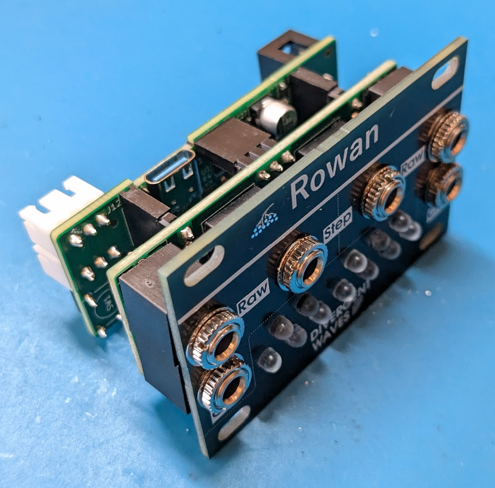

# Rowan

##### What is this?

Rowan is an expander for Sycamore, the dual looping sequencer. Rowan adds a couple of additional features that Sycamore was missing: Unquantized outputs, Chromatic outputs, and a display showing the currently active notes. In addition, Rowan includes two trigger outputs for the Chromatic outputs.

Rowan's core is an RP2040 microcontroller running a small Arduino sketch.

##### How much power does it use?

As measured by the joranalogue Test 3, around 40mA on +12v at peak. The -12v and 5v rails are unused.

##### Where does the design come from?

This one's all me!

##### Are there any rare/weird parts used?

For the most part Rowan's parts should be easy to find. The most difficult parts to source are the adorably small XL-1010RGBC-WS2812B LEDs used to display the scale.

##### Are there any problems with the design?

There is a little light bleed across notes, but in normal use this shouldn't be a problem. If you have suggestions for how to combat this, I'd love to hear them.

##### Do you have a BOM/Mouser cart/Tayda links?

Sorry, no. Things go out of stock so frequently it'd be a lot of work to keep these up to date. Everything in this project is easy to source though, so you should not have any trouble.

##### Can I buy PCBs or a kit?

Available as a [DIY Kit from Tindie](https://www.tindie.com/products/divergentwaves/rowan/), or as a [built module from Reverb](https://reverb.com/uk/item/86800780-divergent-waves-rowan).

<!-- Available as a [DIY Kit from Tindie]([DrumFiend from Divergent Waves on Tindie](https://www.tindie.com/products/divergentwaves/sycamore-dual-looping-eurorack-sequencer/)), or as a [built module from Reverb]([Divergent Waves - Sycamore | Reverb UK](https://reverb.com/uk/item/80138906-divergent-waves-sycamore)).-->

##### Other resources

[Kit BOM](BOM.md)

[Firmware guide](FIRMWARE.md)

[Assembly guide](ASSEMBLY.md)

[Manual](MANUAL.md)

