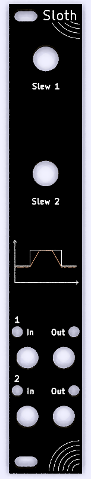

# Sloth (Slew Limiter)

##### What is this?

A 4hp dual slew limiter. Slew times are anything from "about the same as the input" to "a few seconds". You can run audio through it or CV - at audio rates it'll act like a really basic low pass filter!

##### How much power does it use?

As measured by the Joranalogue Test 3, around 20 mA on +12v and 10 mA on -12v at peak. The 5v rail is unused.

##### Where does the design come from?

The original schematic is the Dintree D107 "Slew" module (http://www.dintree.com/#D107), with some modifications to allow for state LEDs for the inputs and outputs. There's a thread discussing the modifications on Muffwiggler (https://www.muffwiggler.com/forum/viewtopic.php?f=17&t=243945).

##### Are there any rare/weird parts used?

Nope! All common parts, although the majority of the passives plus the TL074s are SMD. I got my PCBs made and assembled by JLCPCB, but if you've good eyes and some patience the 0805 parts should be solderable by hand.

##### Are there any problems with the design?

This is one of the few modules that has worked perfectly first time! The one minor nit I do have is that the diagram on the front panel came out with the exposed copper a little thin, and the diagram itself is actually inaccurate - the falling edge of the square wave should be followed by the ramp down in copper (Representing the slew limiter output). But, it looks nicer symmetrical, so I'm not going to change it.

The board layout could maybe use a little love - some of the 0805 components are quite close to where you have to solder the audio jacks for example. Functionally, however, it's great.

##### Do you have a BOM/Mouser cart/Tayda links?

Sorry, no. Things go out of stock so frequently it'd be a lot of work to keep these up to date. Everything in this project is easy to source though, so you should not have any trouble.

##### Can I buy PCBs or a kit?

Send me an email (twigathy+synth@gmail.com)...

