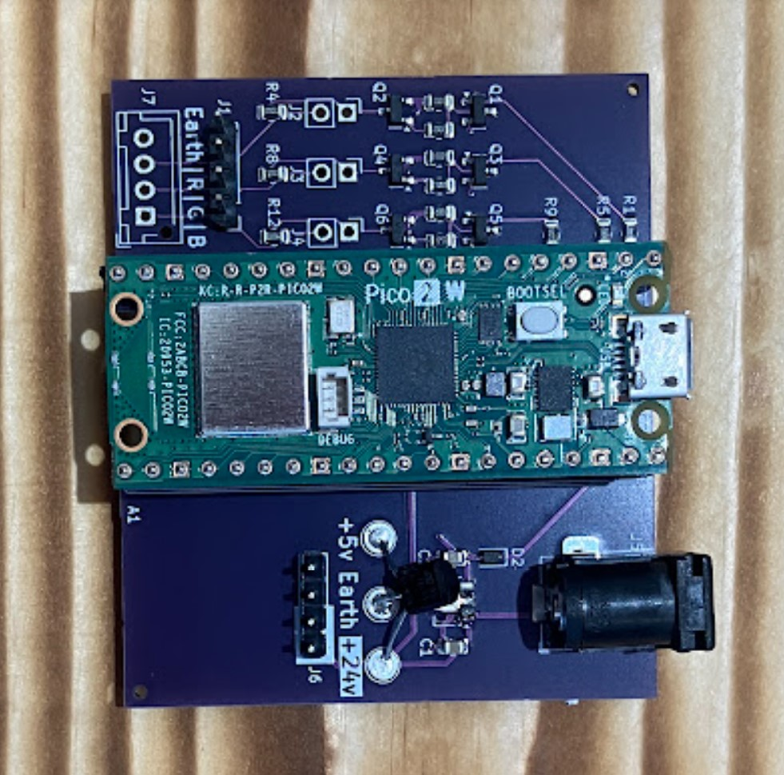

# Stack Light

##### What is this?

A controller PCB for a stack light. At work, I have one hooked up to systems which can tell me when they needed attention. As such the firmware source is, unfortuantely, locked away for now.

<couple of sentences about what the schematics etc. are>

##### How much power does it use?

I have no idea! It will, however, accept anything from about 9v upwards as a supply voltage. Check the datasheet for the stack light to see what supply is appropriate. This will only work with a DC supply, and I have tested up to 24v.

##### Where does the design come from?

This one's all me.

##### Are there any rare/weird parts used?

The stack light can be picked up on ebay, amazon, aliexpress and other such places. Look for DC, low voltage stack lights; AC definitely won't work and would need a very different design.

You will also need a Raspberry Pi Pico W or Pico W 2, if you want to control the light over Wifi or Bluetooth (Strongly recommended!)

##### Are there any problems with the design?

The design was produced in an hour or so in an evening and does have issues:

- The SMT 7805 regulator should have the correct pinout for most uses, but I managed to pick one at JLCPCB that was incorrect. I swapped it out for a through-hole 7805 placed in the test points

- The transistors that switch 24v are driven fairly hard, but do have a 300 ohm current-limiting resistor. As I was unsure how the stack light was driving its LEDs these serve to protect the stack-light board and its power supply. You may bypass them by bridging the two-pin header next to each channel

- It only has 3 channels and does not support stack lights with a buzzer

- The channels are mislabelled "R(ed)", "G(reen)", "B(lue)" rather than red/orange/green

- For some unknown reason I decided on earth instead of ground for some power labels

- You will need to write your own code to drive it - however, it's just three GPIO pins and a Wifi or Bluetooth connection so should not be difficult to reproduce.

##### Do you have a BOM/Mouser cart/Tayda links?

Sorry, no. Things go out of stock so frequently it'd be a lot of work to keep these up to date. Everything in this project is easy to source though, so you should not have any trouble.

##### Can I buy PCBs or a kit?

Send me an email (hello@divergentwaves.co.uk)...

