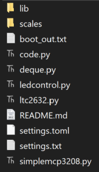

# Sycamore - Firmware

##### Requirements

To program the Sycamore firmware you will need:

- Rasperry Pi Pico

- Micro USB cable. Make sure the cable is not a "charging" cable, you need data and power

- [Sycamore firmware ZIP](https://raw.githubusercontent.com/tpcarlson/synth-diy/main/sycamore/firmware/sycamore-1.5.zip) (Version 1.5)

- The CircuitPython U2F file for Rasperry Pi Pico
  
  - At the time of writing, please use this 8.2.10 release - there are some compatibility issues with the 9.x and 10.x releases that need fixes to be written for Sycamore. https://adafruit-circuit-python.s3.amazonaws.com/bin/raspberry_pi_pico/en_GB/adafruit-circuitpython-raspberry_pi_pico-en_GB-8.2.10.uf2

##### CircuitPython Installation

*If reflashing an already built Sycamore, disconnect Sycamore from your modular synth before programming the Pi Pico!*

1. With the BOOTSEL button held down, plug the Pi Pico in to your computer with a USB cable

2. Wait for the RPI-RP2 drive to appear on your computer. It should show up a little like a USB stick or other removable device

3. Copy the U2F file downloaded above onto the drive

4. The RPI-RP2 drive will vanish, and a new drive called CIRCUITPY will show up

If you do get stuck, try to follow the steps in the [Adafruit tutorial]((https://learn.adafruit.com/getting-started-with-raspberry-pi-pico-circuitpython/circuitpython)) to flash CircuitPython onto the Pi Pico, or feel free to send an email to hello@divergentwaves.co.uk for help.

##### Sycamore Firmware

Open the new CIRCUITPY removable drive. If you still see an RPI-RP2 drive and no CIRCUITPY drive, that means the CircuitPython install didn't work - go back to the previous set of instructions and try again.

Unzip the firmware.zip somewhere on your computer, then copy the extracted files over to the CIRCUITPY drive. You can overwrite the code.py file already present.

Once you're done, the disk's contents should look like this although newer firmware has more files. You may be missing the boot_out.txt:



That's it, the Sycamore firmware is now on your Pico. See [MANUAL.md](MANUAL.md) for how to use the module.

##### Configuring Sycamore

Sycamore has a small configuration file, config.txt, which you may use to configure the module.

auxMode controls the function of the "Aux" input on Sycamore. It can be any of:

- "mutate": Keep the same behaviour as the original firmware, using the Aux CV as a source of randomness when seeding the scale

- "shuffle": Shuffle the current scale. Acts in the same way a long press on the scale encoder does. A long press on the scale encoder will reset the current scale back to the original ordering

- "resetClock": Reset to the start of the sequence

- "transpose": Chromatic transposition for Sycamore's sequences. This is a complement to Diatonic transposition which the Shift control & CV use.

Expanders controls the expanders installed for Sycamore. Oak and Rowan are the only expanders for Sycamore. To enable an expander, add it to the Expanders list in the configuration file. Leave expanders an empty list ("[]") if you have no expanders for Sycamore installed.

```json
{
    "auxMode": "mutate",
    "expanders": ["oak","rowan"],
    "expanderSettings": [
        {
            "expander":"oak",
            "ledBrightness": "20"
        }
    ],
    "dacLookupTable": [0, 68.. (etc)]
}
```

##### Firmware hacking

If you want to change Sycamore's code, try installing the Mu editor first as it does allow for some debugging workflows. Adafruit has an excellent guide to walk through this [Installing the Mu Editor (adafruit.com)](https://learn.adafruit.com/welcome-to-circuitpython/installing-mu-editor). When modifying the firmware, start with code.py and go from there.
