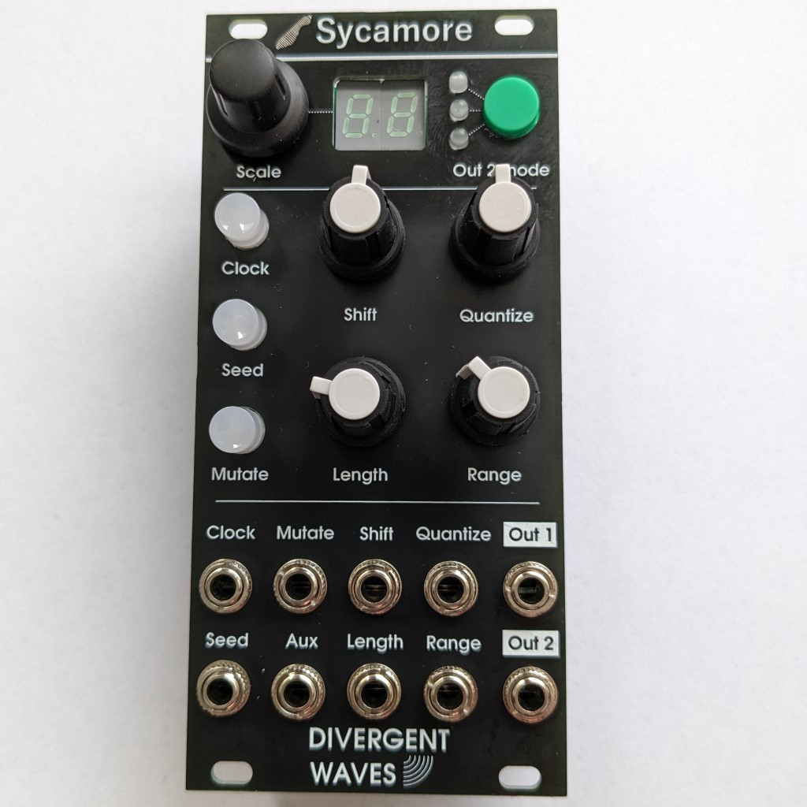

# Sycamore

##### What is this?

Sycamore is a looping quantized sequencer with up to 64 steps, and up to 100 scales. Sycamore allows for CV control over many of its internal parameters including the loop length, range, and note range in a scale to be quantized to.

Some advanced features are accessible through a one-layer menu to allow for more deep tweaking of harmonies, delay, and scale quantization - however, Sycamore is perfectly usable without touching these at all!

Sycamore makes use of CircuitPython for its program code, allowing for easy modification and tweaking should you wish to do so. The module also features an i2c expansion port reserved for future use, or for you own hacking.

##### How much power does it use?

As measured by the joranalogue Test 3, around 60 mA on +12v and 10 mA on -12v at peak. The 5v rail is unused.

##### Where does the design come from?

The original panel design and concept came from the Mutable Instruments [cancelled projects](https://pichenettes.github.io/mutable-instruments-documentation/trivia_and_history/cancelled_projects/) page, and I made some tweaks to get the CV inputs and knob layout to align a little better.

Sycamore also has a few tricks up its sleeve to make it a little more playable, including shuffling the notes in the scale, and changing the harmony or note lag of the second 1v/oct output.

##### Are there any rare/weird parts used?

Sycamore uses easy to find parts, with the possible exceptions of the LTC2632 DAC and the PCA9685 LED driver. The module also uses a Rasperry Pi Pico microcontroller board.

##### Are there any problems with the design?

As Sycamore's firmware runs on top of Circuitpython it's not the _fastest_ module in the world - the trigger inputs require a 5ms+ trigger, although you may get away with as little as 2ms. For most modules that produce triggers this is not a problem, though.

##### Do you have a BOM/Mouser cart/Tayda links?

Sorry, no. Things go out of stock so frequently it'd be a lot of work to keep these up to date. Everything in this project is easy to source though, so you should not have any trouble.

##### Can I buy PCBs or a kit?

Available as a [DIY Kit from Tindie](https://www.tindie.com/products/divergentwaves/sycamore-dual-looping-eurorack-sequencer/), or as a [built module from Reverb](https://reverb.com/uk/item/80138906-divergent-waves-sycamore).

##### Other resources

[Kit BOM](BOM.md)

[Firmware guide](FIRMWARE.md)

[Assembly guide](ASSEMBLY.md)

