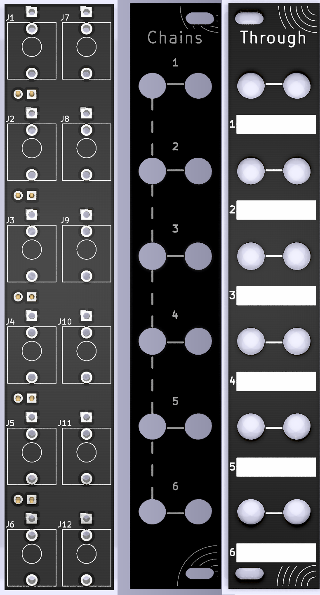

# Through/Links

##### What is this?

A dual-use module, pretty situational usage! With no jumpers set, this acts as a 1:1 signal distributor, a fancy way of saying "You plug something in on the left hand side and it appears on the right hand side". The panel is double sided which means you may use it either as the 1:1 signal distributor, or as a multiple configured how you want it with jumpers.

I'm using mine as an output to an outboard mixer, with output 1 routing to input 1 on the mixer. This makes connecting signals between the Eurorack and the mixer much easier. I use it like a really tiny patch bay. It might also be helpful for connecting between racks.

##### How much power does it use?

None, this is a passive module

##### Where does the design come from?

This one's all me!

##### Are there any rare/weird parts used?

Nope

##### Are there any problems with the design?

Silkscreen for the multiple panel could be a bit prettier, but otherwise it works fine. If I were to make this an active design (ie. a buffered multiple/signal distributor) I'd probably also add LEDs. As it is, it's fine.

Like all passive multiples, plugging lots of things into this at once with jumpers added will end up with all the outputs and inputs connected together which sometimes can cause problems.

##### Do you have a BOM/Mouser cart/Tayda links?

Sorry, no. Things go out of stock so frequently it'd be a lot of work to keep these up to date. Everything in this project is easy to source though, so you should not have any trouble.

