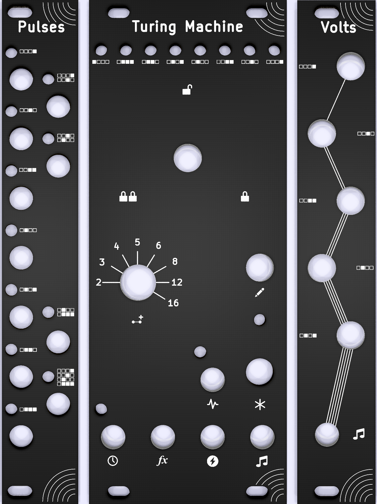

# Turing Machine Panels

##### What is this?

A set of panels for the Music Thing Turing Machine, and the two expanders Volts and Pulses.

##### Where does the design come from?

The hole positioning for potentiometers and jacks came from the Music Thing open source designs:

[Turing Machine](https://github.com/TomWhitwell/TuringMachine)

[Pulses](https://github.com/TomWhitwell/Turing-Pulse-Expander)

[Volts](https://github.com/TomWhitwell/Volts)

Icons came from the [blueprint](https://github.com/palantir/blueprint) open source icon set.

##### Are there any problems with the design?

The lock symbols on the Turing Machine aren't quite aligned with where the potentiometer travel ends, but I think it makes the design a little neater having the three symbols (lock, unlock, double lock) in a somewhat close to equilateral triangle. If this bugs you, then the icons need moving maybe 10-20 degrees further around clockwise or anticlockwise appropriately.

The little squares to indicate numbers can be a little hard to distinguish, making them a touch bigger might be worth doing - but not by much, some negative space is needed. It's not too clear from the pictures here, but the squares are exposed copper rather than silkscreen and they turn out very crisp and shiny. With an ENIG finish they'd be gold coloured, and silver in lead-free HASL.

