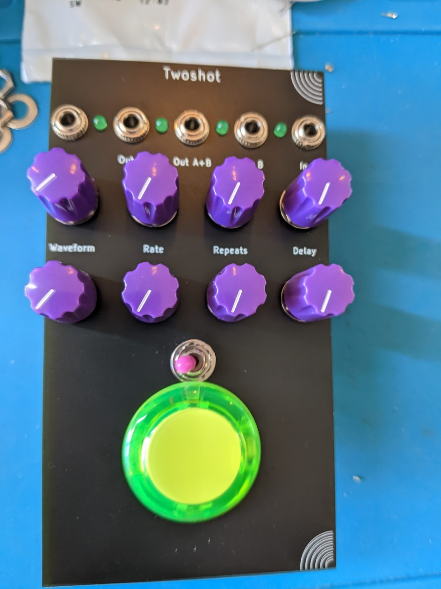

# Twoshot

##### What is this?

Twoshot is a dual one-shot waveform generator. The module uses a pair of Electric Druid [ONESHOT Event Generator](https://electricdruid.net/product/oneshot-event-generator/) chips to generate interesting waveforms when triggered. Twoshot has a pleasingly large 30mm arcade button too.

##### How much power does it use?

On this, I've no idea - the module is currently in pieces! Nothing in it is particularly power-hungry, however there are a few bright LEDs in there to light up the button along with 24 opamps(!). At a guess, around 100mA +12v.

##### Where does the design come from?

This one's mostly on me, with the core parts that interact with the Oneshot chips from the IC's datasheet.

##### Are there any rare/weird parts used?

For the most part, Twoshot should be very easy to source parts for. The possible exceptions are the arcade button and the Oneshot chips themselves. The arcade button I used is a Seimitsu PS-14-K 30mm snap-in button, but any 30mm button should work.

##### Are there any problems with the design?

The normaling from left to right and right to left on the trigger inputs is controlled by some DIP switches at the rear of the module, and never really worked quite as it should. The mixed waveforms should go from 0-10v at the most.

The CV inputs all pass through TL072 opamps with fairly high value resistors (100k), and are then clipped to 0-5v by some BAT42 diodes. If I were to redesign this today, I'd use rail to rail opamps powered by +5v instead.

##### Do you have a BOM/Mouser cart/Tayda links?

Sorry, no. Things go out of stock so frequently it'd be a lot of work to keep these up to date. Almost everything in this project is easy to source though, so you should not have any trouble.

