# Logic - Assembly

##### Before you begin

Is this a 1.0 PCB? If it is, please read the bottom section "Special notes for the v1.0 board".

##### Getting ready

First, gather together the tools you are going to use to assemble the module. At the bare minimum you should be able to do this with just a soldering iron, solder, and side cutters - but there are some additional tools that will make life easier:

- PCB vice or helping hands to hold the PCB in place
- Fan and absorbent material to get rid of solder/flux fumes
- Overhead lighting
- Silicone mat or scrap piece of wood to protect whatever surface you're soldering on
- Solder dispenser
- Tub to hold parts ready for soldering
- Multi-meter for continuity testing

Take a look through the bill of materials and make sure you have all the parts. I like to organise mine by putting them into tupperware or take-away boxes - if you do, just don't use them for food again afterwards.

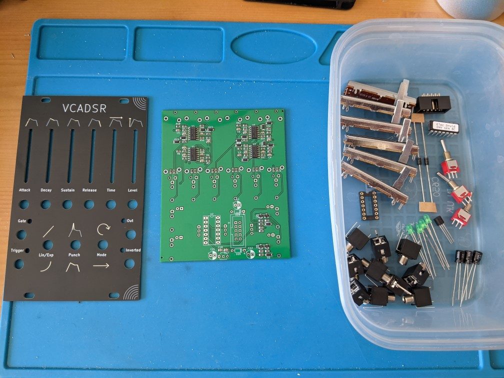

##### Low lying parts

First, solder the Schottky diodes above and below the power connector. These help to prevent connecting up the module's power the wrong way around if there's a bad cable or the header is soldered backwards.

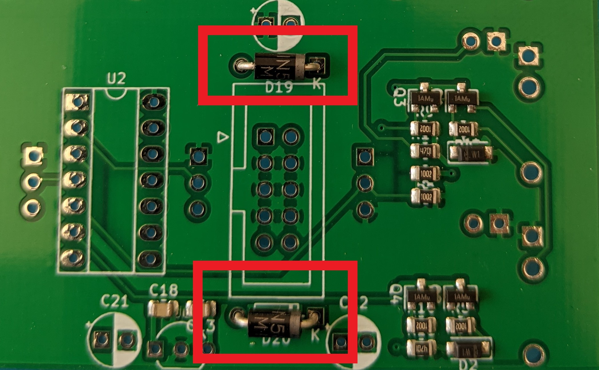

Next, take the 14 pin IC socket and place it as indicated. Make sure the little notch in the IC header matches up with the silkscreen.

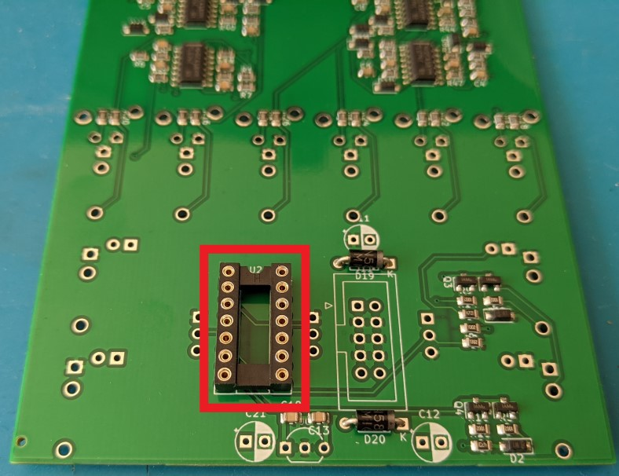

Flip the board over, then solder two pins diagonally opposite. 

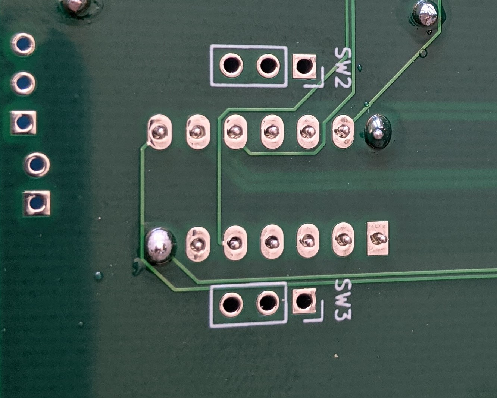

Flip the board over again, and check the IC socket is flat the board. If it's not, heat up the two pins just soldered and push the socket into place.

##### Power

Depending on the 5v regulator, you might need to bend the legs out a little bit to get it to fit. Some 5v regulators come with this already done, but most are just straight-legged. Once you're happy, add the regulator to the board taking care to match the flat edge of the regulator with the silkscreen and solder from the back.

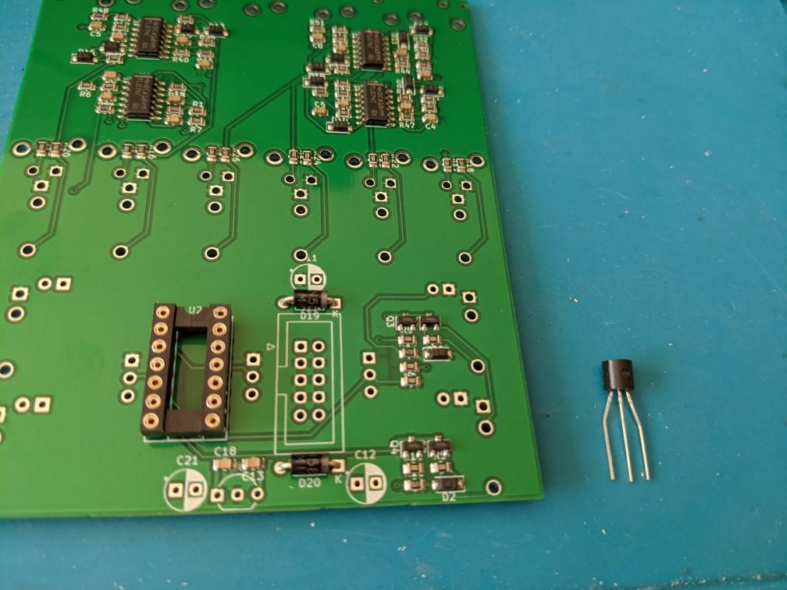

Next, take the 10uF electrolytic capacitors and add them to the board. These are polarised parts, so make sure to match up the white stripe on the capacitor to the silkscreen on the board. Once again, solder from the back making sure the capacitors are nice and flat to the board.

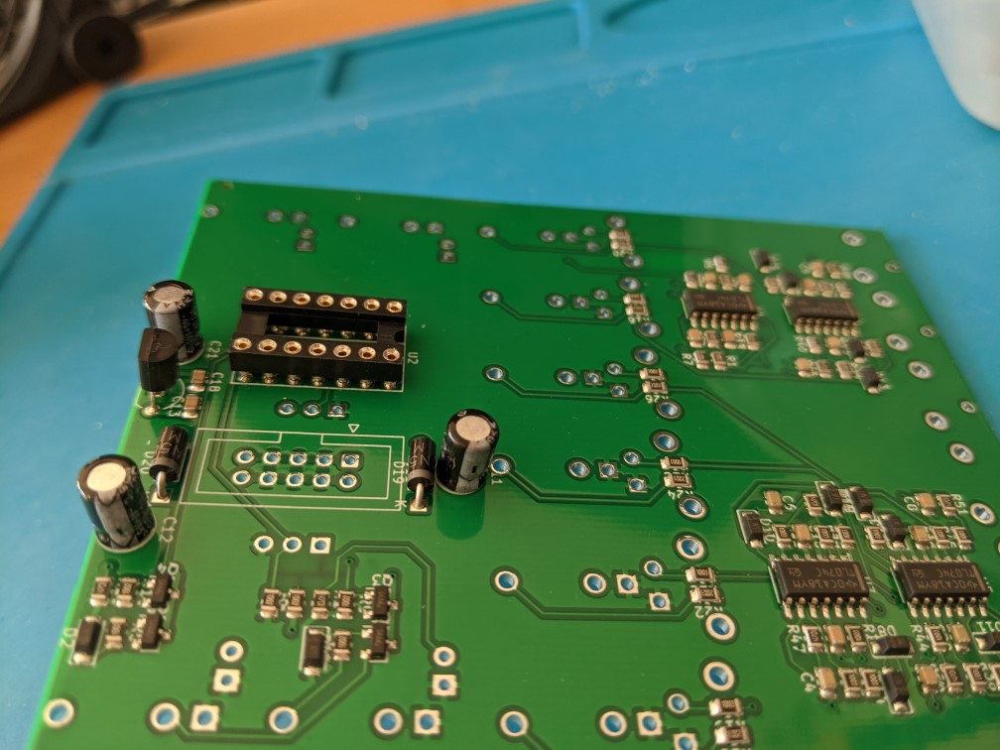 

Next up, take the IDC connector and place it to match the silkscreen.

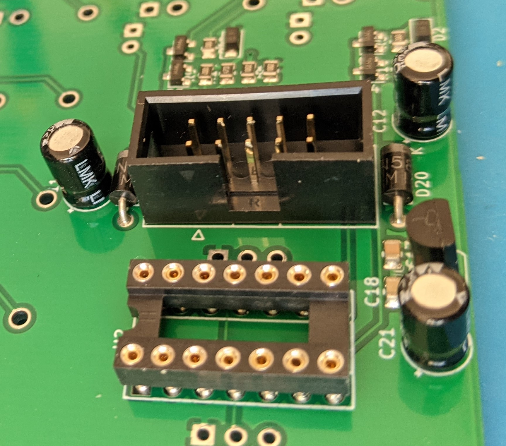

Just like with the IC socket, solder two pins first and check that the power socket sits flat tot he board before soldering the rest.

##### Front panel parts

Gather together all the LEDs, switches, sockets and faders and place them into the board. Don't solder yet - it's best to put the front panel on to get the best fit possible!

LEDs need to be placed with the short leg in the square hole (Ground).

For the switches, the switch on the left hand side should be the three-position on-off-on switch. The middle and right hand switches should be the other on-on switches.

When placing the switches, make sure to add the little washer to each switch - this helps keep the front panel nice and secure and makes the switch feel a little less wobbly!

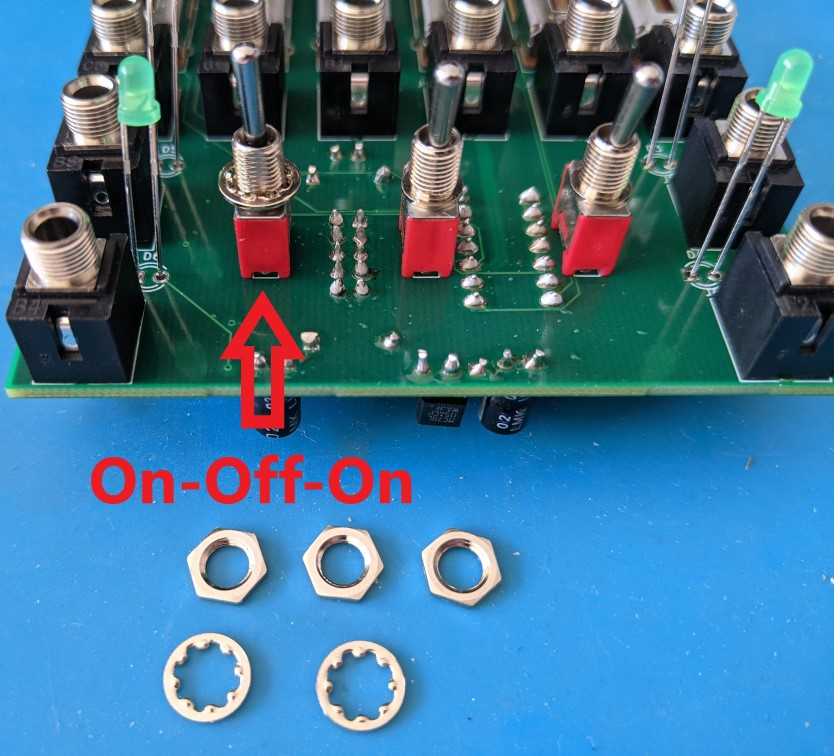

Carefully thread the front panel over the (Unsoldered!) parts. I found it easiest to put all the switches in the down position before doing this. With washers and nuts, secure a couple of the jack sockets to the front panel.

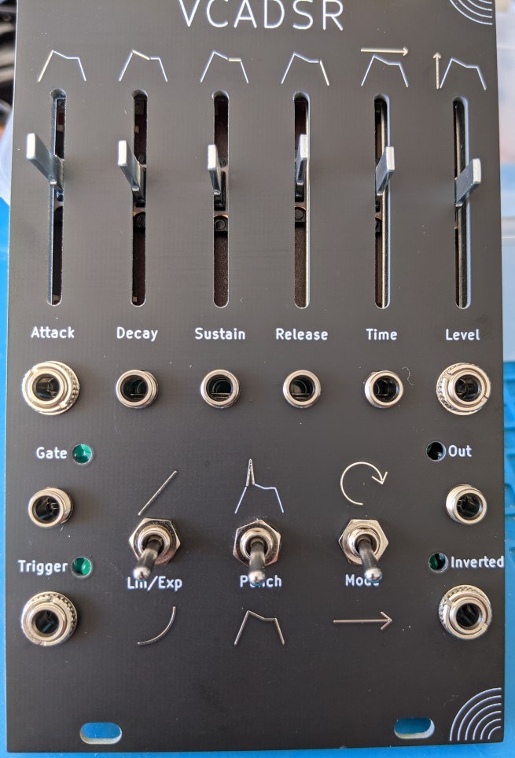

Before flipping the panel over again, it's a good idea to add a little temporary spacer between the panel and the linear potentiometers - there's nothing holding them in place otherwise. I just used a scrap piece of  card here.

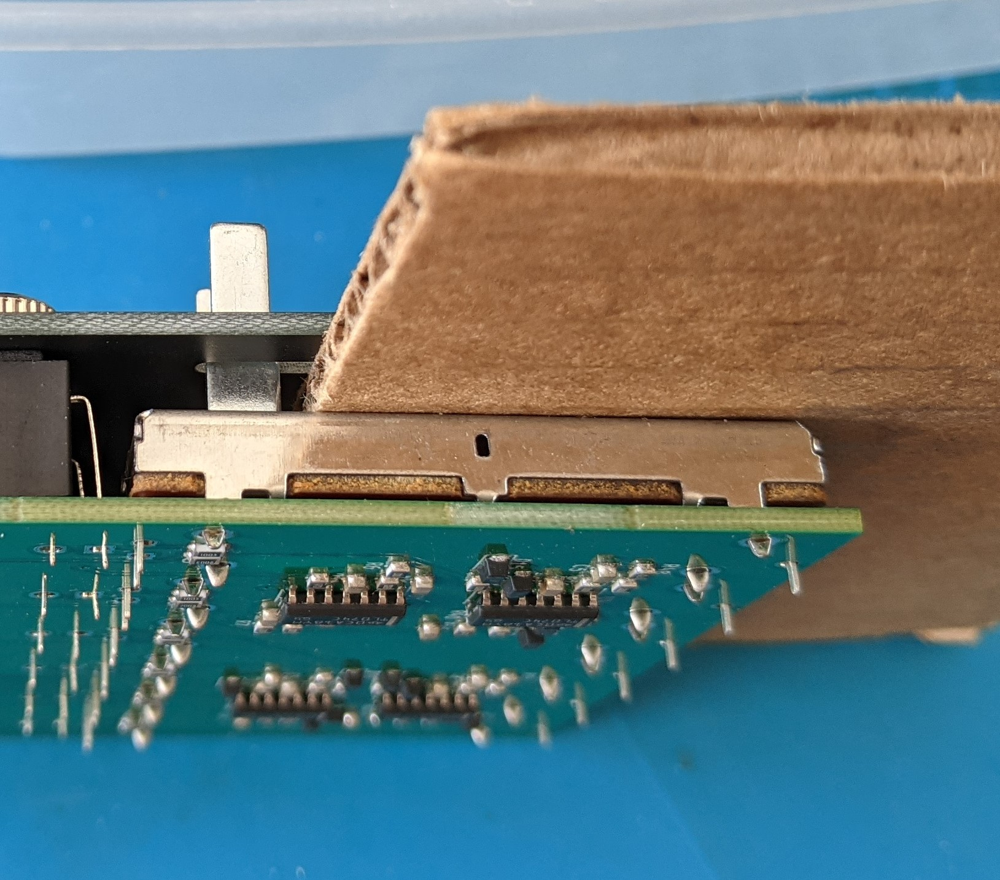

Now you should be good to flip everything over and start soldering away! There are quite a few solder joints to make here - I found it easiest to go around the outside edges first, then fill in the rest that I'd missed out afterwards.

For the slide potentiometers, once one or two solder joints per potentiometers have been made they tend to stay in place nicely and you can get rid of the temporary spacer.

For the LEDs, it's worth doing these last. They need to sit flush against the panel, so before soldering it's worth flipping the board over and checking that they do. If you're using flat topped LEDs here then some masking tape to prevent them poking through is a good idea.

Finally, for the switches you'll want to secure these to the front panel with bolts before soldering to make sure they are upright.

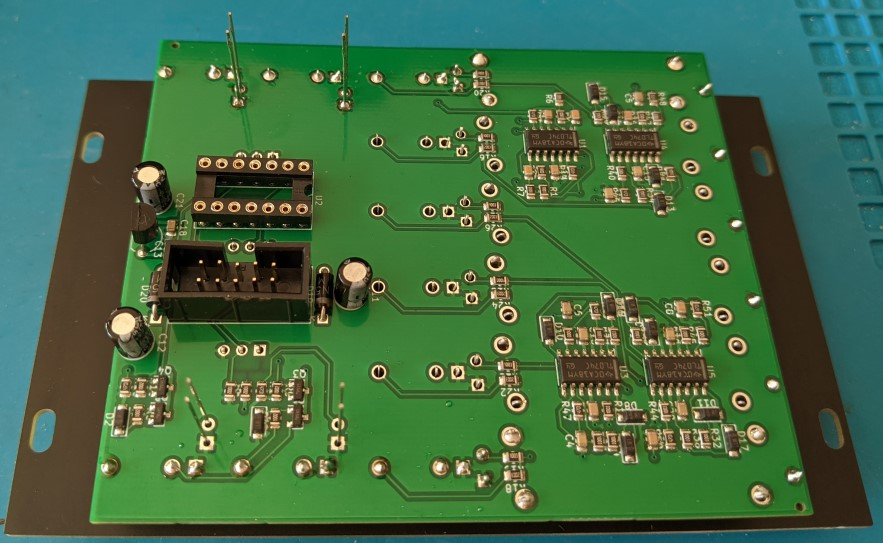

##### Finishing off

Add the EnvGen8 chip to the IC socket, again being careful about the IC's orientation.

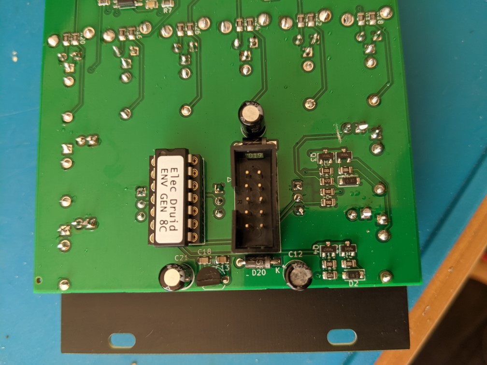

With a multimeter, run a quick continuity check on the power connector, making sure the top and bottom rows don't have continuity (+12 and -12v short), and that neither +12 nor -12 short to the middle set of pins (+/-12v to ground short).

Before adding the rest of the jack socket nuts, it's worth plugging the module in and checking the functions work. Once you're happy, add the nuts and you're done!

##### Special notes for the v1.0 board

*Gate and trigger LEDs*

The first iteration of this board has some design issues (Fixed in this repository), the gate and trigger LEDs have no resistor and will take as much current as they can from 5v to ground. This isn't good! There are a few ways to fix this, or prevent it from being a problem...

Cut traces on the PCB. This is what I've done, it just means the LEDs don't light up for triggers and gates (The output LEDs are fine). I found that a sharp craft knife is best.

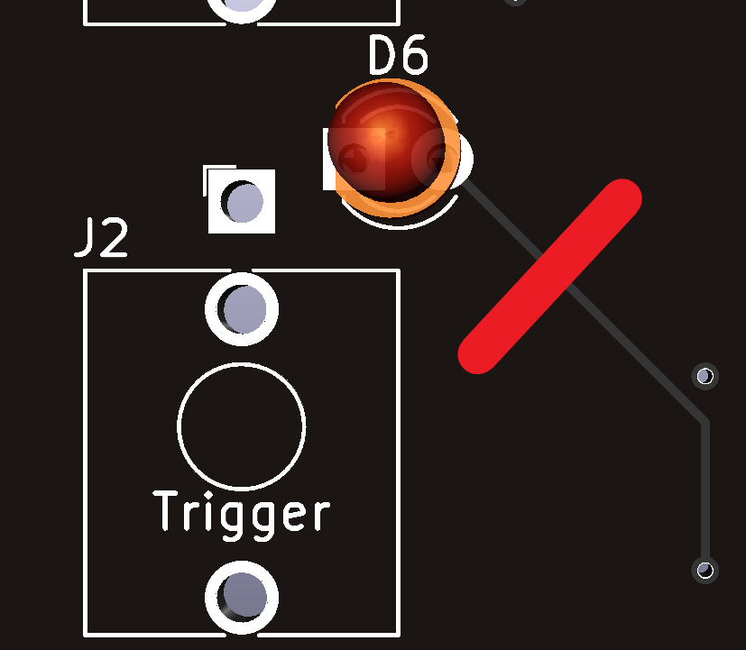

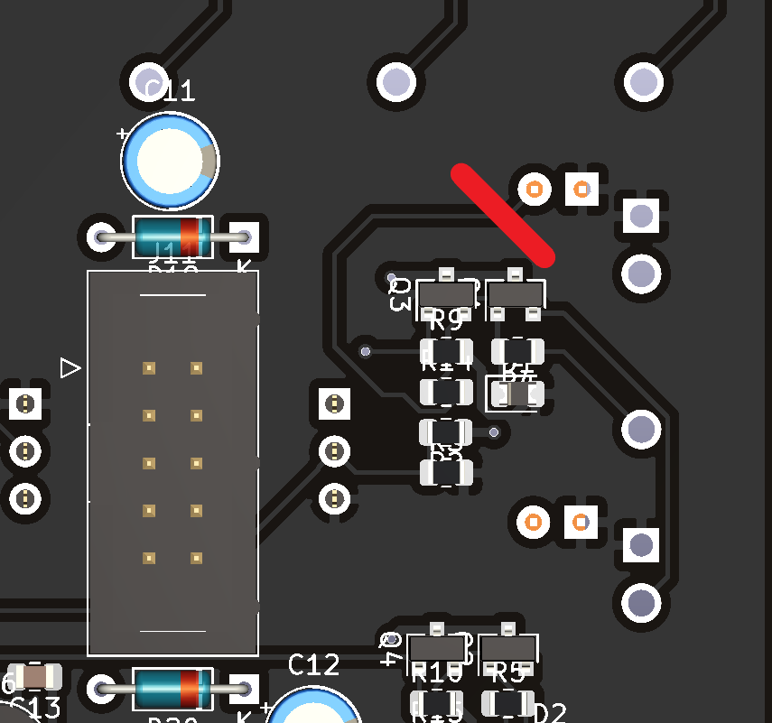

Alternatively, you can try wiring a through-hole resistor on the short leg of the LED to ground. I haven't tried this, but it should work out and doesn't require cutting any traces - just snip the short LED leg much shorter and solder a resistor to it and the square pad.

Finally, you could skip adding the LEDs altogether. This requires no modifications to the PCB itself, but does leave you with two LED-sized holes in the front panel.

*Front panel graphics*

Secondly, the linear/exponential and mode graphics on the front panel is reversed from what it should be - this doesn't make any difference to the functionality other than having to remember the front panel isn't labelled up correctly.

