# YARM+ - Assembly

##### Getting ready

First, gather together the tools you are going to use to assemble the module. At the bare minimum you should be able to do this with just a soldering iron, solder, and side cutters - but there are some additional tools that will make life easier:

- PCB vice or helping hands to hold the PCB in place
- Fan and absorbent material to get rid of solder/flux fumes
- Overhead lighting
- Silicone mat or scrap piece of wood to protect whatever surface you're soldering on
- Solder dispenser
- Tub to hold parts ready for soldering
- Multi-meter for continuity testing

Take a look through the bill of materials and make sure you have all the parts. I like to organise mine by putting them into tupperware or take-away boxes - if you do, just don't use them for food again afterwards.

Here I've gathered everything except for the resistors which are in a set of boxes off-camera.

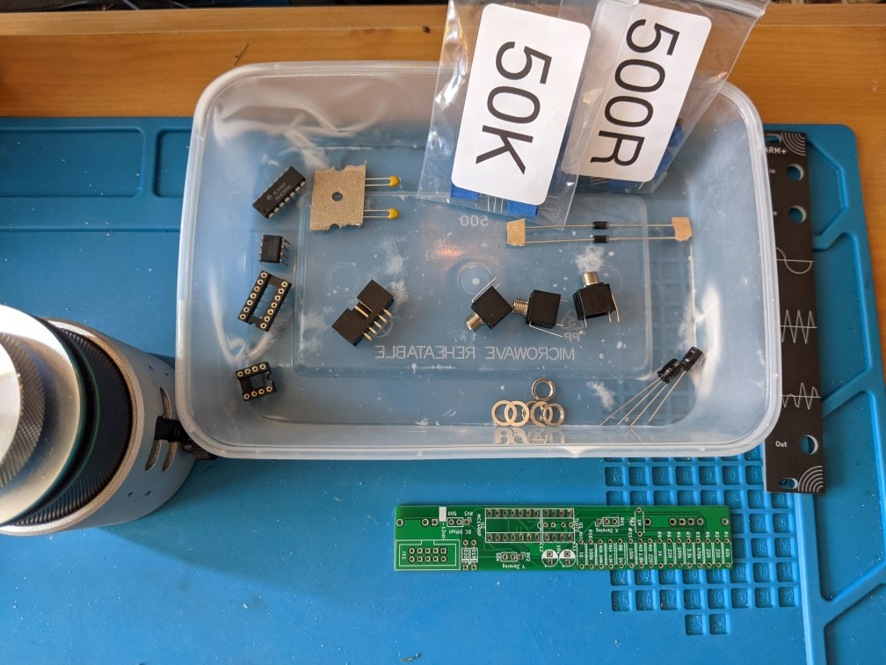

##### Power (Part 1)

First, solder the Schottky diodes above and below the power connector. These help to prevent connecting up the module's power the wrong way around if there's a bad cable or the header is soldered backwards.

These are a polarised part, follow the silkscreen and match the white line on the diode with the white line on the PCB.

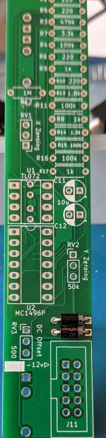

##### Resistors

Resistor values are all silkscreened on to the board, but you may find it easier to open up the PCB in Kicad to check the values. Populate the PCB as the silkscreen indicates.

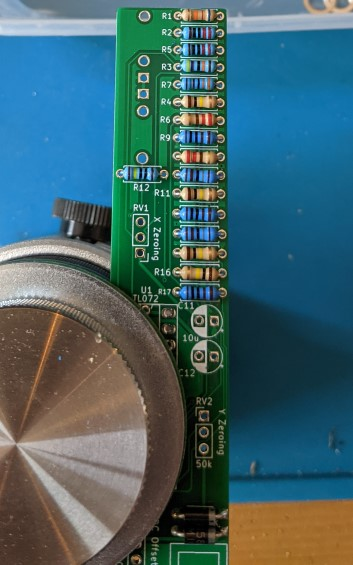

Solder the resistors from the top-down, being careful not to burn the components with your soldering iron! I found that doing all the legs on one side and then the other the easiest.

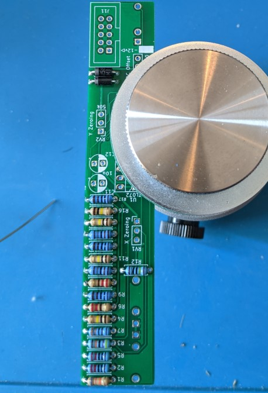

##### ICs

Next, flip the board over and add the bypass capacitors. These **must** be soldered before the IC sockets as they are impossible to get to otherwise!

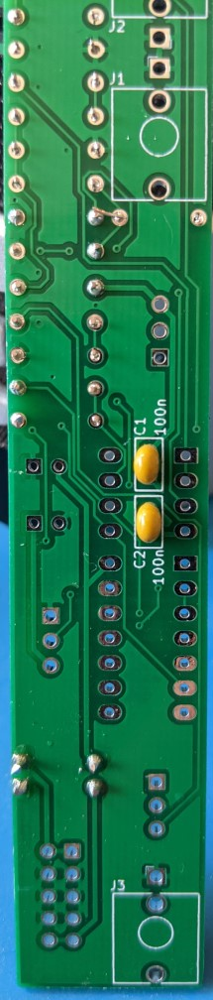

Now flip the board back over and add the 8 pin IC socket. Make sure the notch in the IC socket matches the silkscreen.

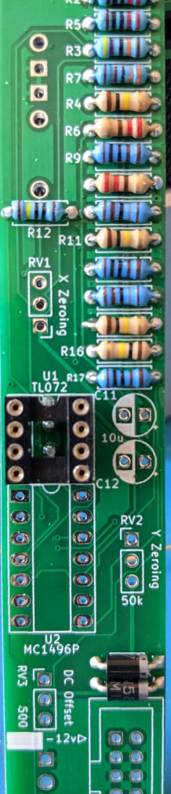

Solder two opposite pins for the IC socket and make sure it's sitting against the PCB nicely.

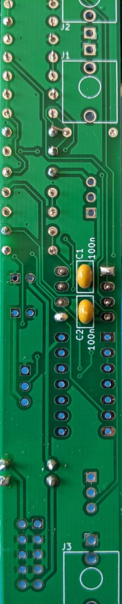

Do the same for the 14 pin IC socket, soldering pins on opposite sides first. 

##### Power (Part 2)

Add the electrolytic capacitors to the board next. These are polarised, the white line on the capacitor must match the silkscreen on the PCB.

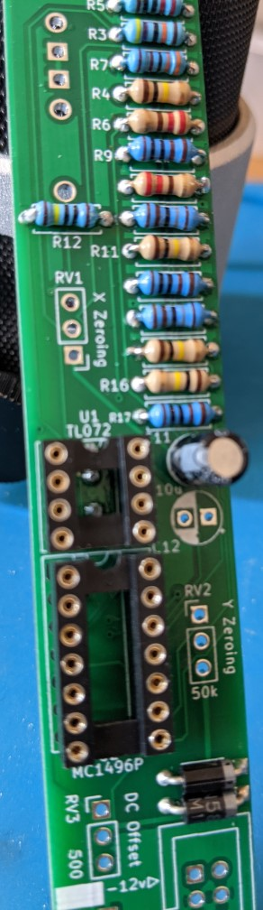

Next, solder the IDC socket for the power. -12v is indicated on the board, but to be sure you can check with a power cable. The red stripe should line up with the -12v marking.

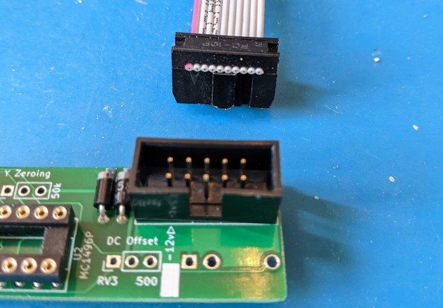

As with the IC sockets, solder a couple of pins and check that the socket lies flat against the board before soldering the rest.

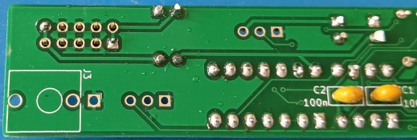

##### Trimmers

Three trimmers are next. The two at the top of the board are 50k and the one at the bottom 500 ohm - don't get them mixed up! Insert these into the PCB and solder, one at a time - trying to do all three at the same time is an exercise in frustration and I don't recommend it!

Just like with the IC sockets, it's best to solder one pin and check that the trimmer lies flat against the PCB before soldering the other two.

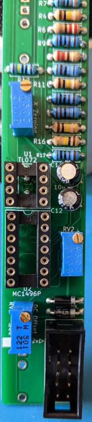

##### Jack sockets

Now, flip the board over again and add the jack sockets. Don't solder them just yet! Carefully thread the front panel over the sockets and add washers and nuts to keep the front panel bolted to the sockets, then solder the sockets.

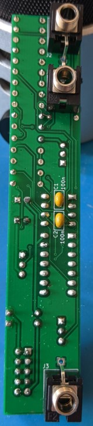

##### ICs

Now that everything is soldered, add the two ICs to the IC sockets. Pay attention to the notch or dot on the ICs and make sure they line up with the notch on the IC socket. The ICs may need a little wiggling to get into position properly, and as the sockets are close together it can be a little tricky!

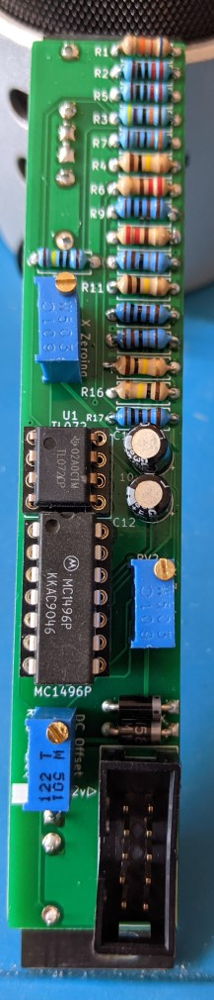

##### Finishing off

With a multimeter, run a quick continuity check on the power connector, making sure the top and bottom rows don't have continuity (+12 and -12v short), and that neither +12 nor -12 short to the middle set of pins (+/-12v to ground short).

##### Calibration

If you want this to be perfectly DC-accurate, you can use the trimmers on the back to affect the X input (top trimmer), Y input (middle trimmer), and bottom trimmer (DC offset at the output). I found that mine seemed happy enough as it was with no adjustments, and left the trimmers alone - but you may wish to tweak and tune to get everything perfect.
