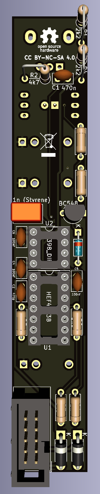

# YASH

##### What is this?

A 5hp (Originally 4hp) sample and hold module, based on the schematic by [Rene Schmitz](https://www.schmitzbits.de/sah.html).

##### How much power does it use?

Basically nothing! As measured by the Joranalogue Test 3, around 10 mA on +12v and 2 mA on -12v at peak. The 5v rail is unused.

##### Where does the design come from?

This is entirely based on the [Rene Schmitz](https://www.schmitzbits.de/sah.html) YASH schematic, but with some modifications to include switches for internal/external clock. This means you can use either the internal clock, the external clock, or both which leads to some pretty interesting results.

##### Are there any rare/weird parts used?

The LF398 used is an 8-pin sample and hold chip which is the core of this whole thing and is definitely required. You'll also need a special capacitor to support this chip - see Rene's site for some more details.

##### Are there any problems with the design?

Unfortunately the first run of this ended up a little broken - the holes for the two switches were just too close to the edge and many of the PCBs ended up damaged during the de-panelling process. v2 (This version) has been increased by a couple of mm from 4hp to 5hp.

The capacitor I used does still have some droop, your mileage might vary. Definitely don't sub the S&H capacitor for a normal capacitor.

The logic PCB is also a touch longer than most of the other designs. It does fit in both the cases I have (Nifty case, and Eurorack Go), but you might want to fiddle with the design a bit to reduce the size of the logic PCB by a couple of mm.

##### Do you have a BOM/Mouser cart/Tayda links?

Sorry, no. Things go out of stock so frequently it'd be a lot of work to keep these up to date. Everything in this project is easy to source though, so you should not have any trouble.

##### Can I buy PCBs or a kit?

Send me an email (twigathy+synth@gmail.com)...

